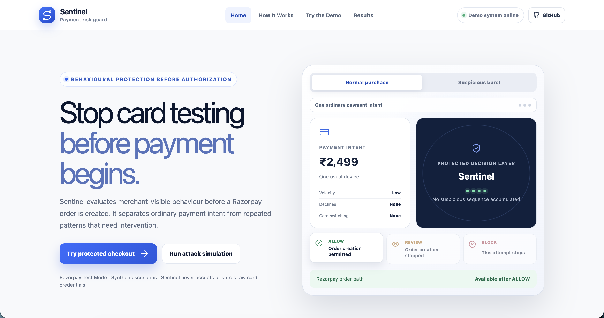
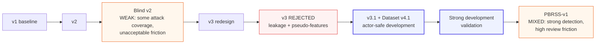
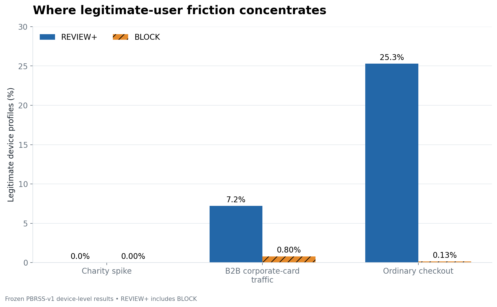
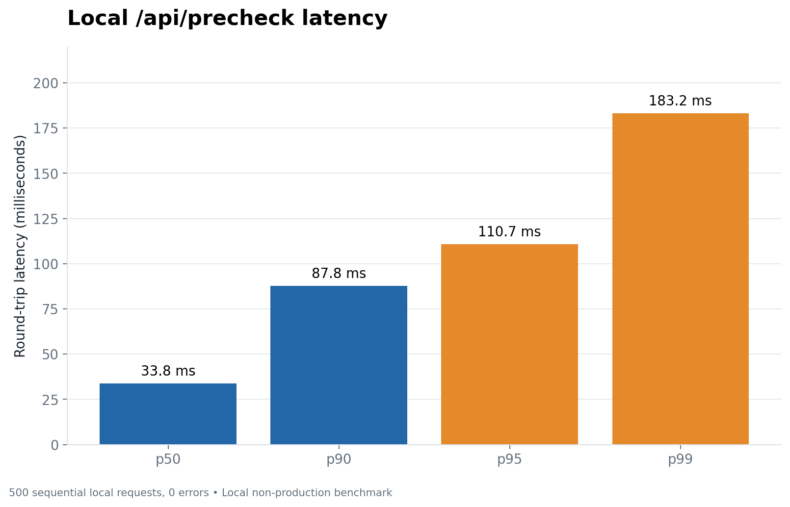

<div align="center">

<h1>Card-Testing Sentinel</h1>

<h2>Stop card testing before payment begins.</h2>

<p><strong>Pre-authorization behavioral protection for Razorpay Checkout.</strong></p>

<p>
Sentinel watches repeated checkout behavior and decides whether to
<code>ALLOW</code>, <code>REVIEW</code>, or <code>BLOCK</code> an attempt before a
Razorpay order is created.<br/>
The current card result cannot influence its own risk decision; only previously
verified gateway outcomes become trusted history.
</p>

<p>
<strong>Built for the <a href="https://razorpay.com/buildathon/">Razorpay AI Buildathon</a></strong><br/>
Track 02 — AI Risk Manager
</p>

<p>


<br/>


</p>

<p>
<a href="#one-decision-layer-between-checkout-and-razorpay">Architecture</a>
&nbsp;•&nbsp;
<a href="#what-the-evaluation-actually-showed">Evaluation</a>
&nbsp;•&nbsp;
<a href="#run-it-locally">Run Locally</a>
&nbsp;•&nbsp;
<a href="#want-to-verify-the-numbers">Evidence</a>
</p>

</div>



| Decision point | Behavior model | Sequential detection | Local latency |
|---|---:|---:|---:|
| Before Razorpay order creation | **44 causal features** | **92.16%** of attack devices by attempt 3 | **33.83 ms p50** |

> **Evaluation status: PBRSS-v1 — MIXED.** Strong attack coverage, but
> legitimate review friction remains too high for production.
> `production_ready=false`

## Table of contents

- [Why card testing is hard to catch](#why-card-testing-is-hard-to-catch)
- [How Sentinel protects the payment flow](#sentinel-decides-before-razorpay-creates-the-order)
- [Architecture](#one-decision-layer-between-checkout-and-razorpay)
- [What Sentinel knows — and what it refuses to use](#what-sentinel-knows--and-what-it-refuses-to-use)
- [Razorpay Test Mode integration](#this-is-connected-to-a-real-razorpay-test-mode-flow)
- [Dataset and model](#how-sentinel-learns-card-testing-behavior)
- [Evaluation results](#what-the-evaluation-actually-showed)
- [Evaluation journey](#how-each-failed-test-changed-the-next-version)
- [Where Sentinel still fails](#where-sentinel-still-fails)
- [Engineering and security](#duplicate-clicks-restarts-and-late-webhooks-should-not-break-payment-state)
- [Run locally](#run-it-locally)
- [Verify the project](#how-to-verify-the-project-yourself)
- [Evidence](#want-to-verify-the-numbers)

## Why card testing is hard to catch

A single failed low-value payment can look ordinary. Card testing becomes more
visible across a sequence: rapid retries, changing cards, rotating sessions or
identities, device and IP changes, repeated verified failures, timing patterns,
and distributed activity.

The hard part is not merely recognizing that a payment failed. It is deciding
whether the next payment attempt is risky while respecting what the merchant
actually knows at that moment.

> Can suspicious card-testing behavior be detected before authorization without
> using information that does not exist yet?

## Why this matters for payment checkout

Card testing and legitimate payment retries can look similar. A real customer
may retry because an OTP or payment failed, the network dropped, a card was
temporarily declined, or another card was tried. An attacker may also retry
rapidly, change cards, rotate sessions, or spread attempts across devices.

Simply blocking repeated failures would hurt legitimate customers. Sentinel
tries to distinguish the behavioral pattern before creating the Razorpay order.

## Sentinel decides before Razorpay creates the order

```text
Merchant checkout
    → Sentinel precheck
    → trusted behavioral history
    → 44 causal features
    → Model v3.1
    → Policy v2
    → ALLOW / REVIEW / BLOCK
```

The decision controls the payment boundary:

| Sentinel decision | Razorpay action |
|---|---|
| `ALLOW` | A Razorpay Test Mode order may be created |
| `REVIEW` | No Razorpay order is created |
| `BLOCK` | No Razorpay order is created |

`REVIEW` is a Sentinel policy state. It is not Razorpay manual review, 3DS,
OTP, issuer review, or evidence that a bank was contacted.

## One decision layer between checkout and Razorpay

```mermaid
flowchart LR
    A[React Checkout] --> B[POST /api/precheck]
    B --> C[Schema validation<br/>HMAC protection]
    C --> D[Trusted historical state]
    D --> E[FeatureEngineV3<br/>44 causal features]
    E --> F[Model v3.1<br/>hist_gb_2 + sigmoid]
    F --> G[Policy v2]
    G --> H{Decision}

    H -->|ALLOW| I[Create Razorpay<br/>Test Mode order]
    H -->|REVIEW / BLOCK| J[Suppress order creation]

    I --> K[Razorpay Standard Checkout]
    K --> L[Signed gateway webhook]
    L --> M[Verified trusted outcome]
    M --> N[Future historical state]
    N -. later request .-> D

    classDef decision fill:#eef2ff,stroke:#4f46e5,stroke-width:2px;
    classDef gateway fill:#fff7ed,stroke:#ea580c,stroke-width:2px;
    class H decision;
    class I,K,L gateway;
```



The risk decision is persisted before any Razorpay order is requested. Only the
`ALLOW` branch crosses the gateway boundary; `REVIEW` and `BLOCK` suppress order
creation entirely.

## What Sentinel knows — and what it refuses to use

Sentinel deliberately separates decision-time facts from post-authorization
facts.

| Available before authorization | Not used from the current payment |
|---|---|
| Amount and merchant | PAN or CVV |
| Device and session history | Current card network or card type |
| Customer continuity | Current authorization result |
| Request velocity and timing | Current decline reason |
| Previous trusted failures | Future payment status |
| Previous successful checkouts | Any browser-only failure as trusted history |
| Historical card diversity | Post-authorization gateway metadata |
| Historical IP/network behavior | Data learned after the decision |

### The current card cannot influence its own risk decision

Sentinel scores the checkout before authorization. At that moment it does not
know the current card network, current card type, authorization result, decline
reason, or payment status.

Safe card metadata can become historical evidence only after a signed Razorpay
webhook has been verified by the backend. It can then affect a future request,
never the request that introduced it.

```text
precheck → decision → payment → signed outcome → historical state → future precheck
```

## This is connected to a real Razorpay Test Mode flow

Sentinel does not only show a risk score on a dashboard. The decision controls
whether the Razorpay order is created.

```text
ALLOW  → Razorpay order created
REVIEW → no Razorpay order
BLOCK  → no Razorpay order
```

After an allowed payment begins, signed gateway events determine what becomes
trusted history. End-to-end Razorpay Test Mode verification established that:

- only `ALLOW` creates a real Razorpay order; `REVIEW` and `BLOCK` create none;
- Razorpay Standard Checkout is opened only for an eligible persisted request;
- signed `payment.failed` webhooks are authoritative for failed-payment history;
- browser failure callbacks remain visibly separate and never create a trusted
  decline;
- duplicate webhook deliveries and order requests are idempotent;
- changed-content identifier reuse is rejected rather than silently replayed;
- payment lifecycle transitions are monotonic, so stale events cannot regress
  state;
- abandoned orders without a terminal signed webhook are non-authoritative and
  are not counted as declines; and
- safe gateway card metadata is added only to future behavioral history.

Real Test Mode multi-card verification also confirmed the causal progression of
historical card diversity: the second signed failed payment increased distinct
historical cards and card networks only after its webhook was accepted. Full
evidence is in the [real Razorpay failure lifecycle report](reports/phase_5b_1_real_razorpay_failure_lifecycle.md).

## What is running now

The evaluator-facing application uses the frozen selection declared in
[`configs/runtime_v3_1.yaml`](configs/runtime_v3_1.yaml).

| Field | Active value |
|---|---|
| Runtime | `postblind-v3.1-prototype-runtime` |
| Runtime stage | `evaluated_prototype_candidate` |
| Production ready | **false** |
| Features | **44** |
| Feature contract | `merchant-visible-causal-3.1` |
| Model | `model-v3.1` |
| Candidate | `hist_gb_2` |
| Calibration | `sigmoid` |
| Policy | `validation-selected-v2` |
| Evaluation | `pbrss-v1` |
| Conclusion | **MIXED — strong attack detection, but too much legitimate review friction** |

Model v2 remains in the repository as frozen historical evidence. It is not the
current runtime model.

## How Sentinel learns card-testing behavior

Dataset v4.1 is a synthetic causal-development corpus designed around both
card-testing attacks and difficult legitimate behavior.

| Dataset v4.1 measure | Value |
|---|---:|
| Lifecycle events | **179,283** |
| Authorization requests | **69,274** |
| Devices | **12,000** |
| Merchants | **20** |
| Causal features | **44** |

The scenarios include cross-device guest attacks, partial-identity campaigns,
distributed bots, subscription dunning, persistent genuine card problems,
network retry storms, shared household devices, and carrier-grade NAT traffic.
The feature matrix contains no label, scenario, actor identifier, current
payment outcome, or future gateway response.

An earlier Model v3 experiment was **rejected** because its validation contained
actor/group leakage and ungrounded pseudo-features. Dataset v4.1 and Model v3.1
corrected that methodology by grouping correlated actors, campaigns, households,
and counterfactual twins into non-straddling evaluation units.

The key partition checks are explicit:

| Leakage check | Overlap |
|---|---:|
| Train / validation leakage groups | **0** |
| Train / validation actors | **0** |
| Train / validation customers | **0** |
| Cross-validation fold-straddling groups | **0** |
| Campaign and household fold overlap | **0** |

### Feature families

The 44-feature contract summarizes merchant-visible, causal signals rather than
accepting client-computed risk attributes. Its main families are:

- **Velocity:** How many attempts happened recently, across short and long
  windows?
- **Outcome history:** Did previous verified attempts fail repeatedly, or did
  earlier checkouts succeed?
- **Card diversity:** How many different cards appeared in trusted historical
  outcomes, and did the card change after a decline?
- **Identity continuity:** Is this a known returning customer or device, or a
  new identity?
- **Session behavior:** Is the shopper repeatedly creating or switching
  sessions?
- **Network behavior:** Is the device rapidly changing IP or network context,
  or sharing it unusually?
- **Temporal shape:** Do attempts resemble a burst, retry loop, or slow drip?
- **Amount behavior:** Are amounts changing repeatedly or staying around low
  testing values?

Current-card attributes and future outcomes remain outside the decision-time
feature contract.

### Model v3.1

Model v3.1 looks at the 44 behavioral signals together and estimates how risky
the current attempt looks using only history available at that moment. It is a
scikit-learn Histogram Gradient Boosting classifier bound to the
`merchant-visible-causal-3.1` contract and calibrated with sigmoid calibration.
Thirteen candidates were evaluated using actor-safe grouped cross-validation;
the frozen selection is `hist_gb_2`.

| Parameter | Frozen value |
|---|---:|
| `learning_rate` | `0.08` |
| `max_leaf_nodes` | `31` |
| `max_iter` | `150` |
| `l2_regularization` | `2.0` |
| Calibration | `sigmoid` |
| Feature count | `44` |

## What the evaluation actually showed

### Development test

On the synthetic development environment, Model v3.1 separated attacks and
legitimate traffic well. These are held-out Dataset v4.1 development results,
not production Razorpay performance.

| Metric | Result |
|---|---:|
| Attack `REVIEW+` | **93.49%** |
| Attack `BLOCK` | **67.46%** |
| Legitimate `REVIEW+` | **3.14%** |
| Legitimate `BLOCK` | **0.14%** |
| PR-AUC | **0.9169** |
| ROC-AUC | **0.9693** |
| Brier score | **0.0410** |
| Expected calibration error | **0.0214** |
| Counterfactual Pair Ordering Accuracy | **100% (20/20 pairs)** |

### Harder shifted stress test

When the traffic distribution changed, attack detection stayed strong, but too
many legitimate checkouts were sent to `REVIEW`. PBRSS-v1 is a predeclared,
consumed post-Blind remediation stress suite. Its frozen conclusion is **MIXED
— strong attack detection, but too much legitimate review friction**.

| Metric | Result |
|---|---:|
| Attack `REVIEW+` | **96.40%** |
| Attack `BLOCK` | **59.12%** |
| Legitimate `REVIEW+` | **20.72%** |
| Legitimate `BLOCK` | **0.16%** |
| PR-AUC | **0.646976** |
| ROC-AUC | **0.726189** |
| Brier score | **0.156037** |
| Expected calibration error | **0.140679** |
| Log loss | **0.6538091381** |
| Conclusion | **MIXED — strong attack detection, but too much legitimate review friction** |

Attack coverage remained strong, but legitimate review friction and calibration
degraded substantially under shift.

### Development versus stress

| Measure | Development v4.1 | PBRSS-v1 shifted stress |
|---|---:|---:|
| Attack `REVIEW+` | 93.49% | 96.40% |
| Legitimate `REVIEW+` | 3.14% | **20.72%** |
| Legitimate `BLOCK` | 0.14% | 0.16% |
| PR-AUC | 0.9169 | 0.646976 |
| Brier | 0.0410 | 0.156037 |
| ECE | 0.0214 | 0.140679 |

These are different synthetic distributions with different purposes. They are
not an apples-to-apples leaderboard or a controlled estimate of production
generalization.

## How each failed test changed the next version

The project evolved through evidence, including results that invalidated prior
assumptions.

| Stage | Result | What changed or was learned |
|---|---|---|
| v1 | First behavioral baseline | Established the causal pre-authorization approach |
| v2 | More historical behavior | Added stronger history and identity continuity |
| Blind v2 | **WEAK — attack coverage existed, but legitimate friction was unacceptable** | Exposed dunning and retry friction |
| v3 | **REJECTED** despite stronger-looking metrics | Audit found grouping leakage and ungrounded pseudo-features |
| v3.1 | Rebuilt with actor-safe evaluation | Used group-safe partitions and 44 causal features |
| PBRSS-v1 | **MIXED — strong attack detection, but too much legitimate review friction** | Shifted stress exposed calibration and ordinary-checkout friction |

### Historical Blind v2 result

Blind v2 is frozen historical Model v2 evidence, not the active runtime
evaluation.

| Historical Blind v2 metric | Result |
|---|---:|
| Attack `REVIEW+` | **70.50%** |
| Attack `BLOCK` | **34.125%** |
| Legitimate `REVIEW+` | **14.9062%** |
| Legitimate `BLOCK` | **5.0937%** |
| PR-AUC | **0.487127** |
| ROC-AUC | **0.735120** |
| Brier score | **0.152069** |
| Expected calibration error | **0.117139** |
| Verdict | **WEAK — attack coverage existed, but legitimate friction was unacceptable** |

Its frozen governance state is `evaluated=true`, `consumed=true`, and
`post_blind_tuning=false`.



The v3 experiment produced stronger-looking metrics, but it was rejected after
the audit found grouping leakage and ungrounded pseudo-features. The rejected v3
experiment and weak Blind v2 result are retained as provenance, not hidden as
failed iterations.

## The pattern becomes clear after repeated attempts

### Behavioral history changes the decision

**23.20% detected by attempt 1 → 92.16% by attempt 3 → 96.40% by attempt 5**


| Attempt | Attack devices detected by that attempt |
|---:|---:|
| 1 | **23.20%** |
| 2 | **25.20%** |
| 3 | **92.16%** |
| 5 | **96.40%** |

One transaction may not provide enough evidence. Repeated behavior reveals the
card-testing pattern, with the largest gain at attempt 3.

### Where the current model becomes too cautious



On PBRSS-v1, Sentinel hard-blocked only **0.16%** of legitimate devices, but sent
**20.72%** to `REVIEW`. Ordinary checkout reached **25.30%** `REVIEW+`. That
level of customer friction is too high for production, which is why
`production_ready` remains **false**. The Brier and ECE results above also show
that calibration degraded under this shifted distribution.

### Local HTTP performance



The benchmark sent 500 sequential requests through the complete local
`/api/precheck` HTTP path, including validation, HMAC tokenization, state loading,
44-feature computation, model scoring, policy evaluation, and SQLite WAL
persistence.

| Local benchmark metric | Result |
|---|---:|
| p50 | **33.83 ms** |
| p95 | **110.73 ms** |
| p99 | **183.19 ms** |
| Failures | **0 / 500** |

This is a **local benchmark**, not a production SLA.

## Which signals actually mattered

- The relationship/entity feature family produced the largest measured
  performance loss when removed.
- `customer_id_present` behaved more like a legitimate trust prior than an
  attack flag.
- Historical trust helped reduce false friction for established customers.
- Distributed bot campaigns remained difficult to hard-block.

See the [full Model v3.1 ablation report](reports/phase_2_6_model_v3_1_ablations.md)
for the controlled experiments and scenario-level results.

## Duplicate clicks, restarts and late webhooks should not break payment state

These safeguards protect the behavioral record around a payment:

- **Duplicate Pay click:** should not create another decision or order.
- **Late webhook:** should not move a captured or failed payment backward.
- **Backend restart:** should not forget previous behavioral history.
- **Browser failure callback:** should not be trusted as a bank outcome.

The runtime therefore behaves as a stateful payment control, not a stateless
model endpoint:

- exact retries return the persisted decision without rescoring;
- changed-content identifier reuse returns a conflict;
- lifecycle transitions are monotonic;
- SQLite runs in WAL mode with transactional persistence;
- restart recovery reconstructs and verifies persisted state;
- browser events cannot impersonate signed gateway outcomes;
- Razorpay order creation is gated to `ALLOW`; and
- runtime manifests verify the active feature, model, policy, and evaluation
  artifacts before readiness.

The `/api/demo/*` simulation is explicitly namespaced and server-generated. It
does not expose arbitrary outcome or checkout-history writes for live Razorpay
checkout identifiers and is not part of the authoritative gateway-history path.

## What Sentinel trusts — and what it rejects

Sentinel treats the browser as untrusted for payment outcomes.

- HMAC-SHA256 protects persisted customer, device, session, merchant, and IP
  identifiers.
- Razorpay payment signatures and webhook signatures are verified server-side.
- Strict schemas reject PAN, CVV, client-computed features, labels, and unknown
  fields from the risk endpoint.
- Secrets are environment-based and excluded from version control.
- Runtime and development dependencies are locked.
- The final Python and npm dependency audits found **0 known vulnerabilities**
  in the verified environments.

See the [dependency security audit](reports/dependency_security_audit.md) for the
advisory-by-advisory evidence.

## Technology stack

| Layer | Technology |
|---|---|
| Frontend | React, TypeScript, Vite |
| Backend | FastAPI, Python 3.11 |
| ML | scikit-learn, Histogram Gradient Boosting |
| Persistence | SQLite WAL |
| Payments | Razorpay Standard Checkout, Test Mode |
| Security | HMAC-SHA256, signed webhooks |
| Testing | pytest, Vitest, Node test runner |
| Packaging | Docker, GitHub Actions |

## Repository structure

```text
frontend/                     React product interface
src/card_testing_sentinel/    FastAPI runtime, features, model and policy code
configs/                      Versioned runtime and experiment contracts
artifacts/                    Frozen models, evaluations and figures
pipelines/                    Dataset, training and evaluation pipelines
scripts/                      Verification, benchmarking and utility commands
tests/                        Python, integration and frontend tests
reports/                      Evaluator-facing technical evidence
docs/                         Architecture, API and methodology documentation
archive/                      Superseded and historical development evidence
```

`archive/` preserves meaningful provenance without presenting superseded work as
part of the active system.

## Run it locally

Requirements: Python 3.11 and Node.js 22.13.1 or newer.

```bash
git clone https://github.com/nirajj12/Card-Testing-Sentinel.git
cd Card-Testing-Sentinel

python3.11 -m venv .venv
source .venv/bin/activate
python -m pip install --upgrade pip==26.2.1 setuptools==84.0.0
python -m pip install --no-deps -r requirements-runtime.lock
python -m pip install --no-deps -r requirements-dev.lock
python -m pip install --no-deps --no-build-isolation -e .

npm ci
npm run build

export CTS_HMAC_SECRET='replace-with-a-long-private-local-secret'
python scripts/run_app.py
```

Open `http://127.0.0.1:8000`. Keep `CTS_HMAC_SECRET` stable when reusing a
persisted local database. Razorpay Test Mode additionally requires
`RAZORPAY_KEY_ID`, `RAZORPAY_KEY_SECRET`, and `RAZORPAY_WEBHOOK_SECRET`; live-mode
key IDs are rejected.

### API summary

| Method | Route | Purpose |
|---|---|---|
| `GET` | `/health/live` | Process liveness |
| `GET` | `/health/ready` | Active runtime and artifact readiness |
| `GET` | `/api/system` | Runtime, model, policy, evaluation, and gateway status |
| `POST` | `/api/precheck` | Persist a pre-authorization decision |
| `POST` | `/api/razorpay/orders` | Create a Test Mode order for `ALLOW` only |
| `POST` | `/api/razorpay/payments/verify` | Verify Standard Checkout payment signature |
| `POST` | `/api/webhooks/razorpay` | Verify and apply a Razorpay webhook |
| `GET` | `/api/activity/recent` | Read sanitized recent activity |
| `GET` | `/api/metrics/blind` | Read frozen historical evaluation aggregates |

The [API guide](docs/api.md) documents request contracts, state transitions, and
read-only runtime views.

## Docker

The current Dockerfile uses a Node 22.13.1 Alpine build stage to install locked
frontend dependencies and compile the React bundle. A Python 3.11.15 slim
runtime stage installs `requirements-runtime.lock`, packages the application,
copies the compiled frontend, runs as the non-root `sentinel` user, exposes port
8000, declares `/app/data/runtime` as a volume, and checks `/health/ready`.

```bash
docker build -t card-testing-sentinel .
docker run --rm \
  -p 8000:8000 \
  -e CTS_HMAC_SECRET='replace-with-a-long-private-local-secret' \
  -v card_testing_state:/app/data/runtime \
  card-testing-sentinel
```

This describes the repository's container packaging; it is not a claim of
production deployment or production readiness.

## How to verify the project yourself

```bash
ruff format --check .
ruff check .
npm ci
npm run lint
npm test
npm run build
pytest --cov-report=term-missing --cov-fail-under=80
python scripts/verify_release.py
python scripts/verify_runtime_v3_1.py
```

Final validated state:

| Check | Result |
|---|---|
| Python | **280 passed** |
| Frontend | **69 passed** — 31 legacy + 38 React |
| Frontend lint | **PASS** |
| Frontend production build | **PASS** |
| Historical release verifier | **PASS** |
| Active v3.1 runtime verifier | **PASS** |

The two verifiers serve different integrity boundaries:

- `verify_release.py` protects frozen historical Model v2 and Blind v2 evidence;
- `verify_runtime_v3_1.py` first preserves that historical boundary, then
  validates the active 44-feature Model v3.1 runtime and PBRSS-v1 artifacts.

Slow regeneration, training, and ignored-data-dependent checks are retained
behind the `slow` pytest marker and are not clean-clone release gates.

## Where Sentinel still fails

- **Synthetic evidence:** Development data and PBRSS-v1 are synthetic. PBRSS-v1
  is a shifted stress suite, not a fresh independent blind benchmark or
  production traffic.
- **Earlier failure:** Historical Blind v2 was **WEAK — attack coverage existed,
  but legitimate friction was unacceptable**.
- **Current mixed result:** PBRSS-v1 was **MIXED — strong attack detection, but
  too much legitimate review friction**.
- **Customer friction:** PBRSS-v1 sent **20.72%** of legitimate devices to
  `REVIEW+`, including **25.30%** in ordinary checkout.
- **Calibration shift:** The probabilities learned on development traffic did
  not transfer cleanly to the shifted stress traffic.
- **Distributed attacks:** These remain difficult to hard-block consistently.
- **Test Mode only:** No real card network was charged, and there is no
  production traffic validation.
- **Single-process state:** SQLite and the transition lock are not a distributed
  storage design.
- **Missing production controls:** Production authentication, tenant isolation,
  distributed state, queue reconciliation, rate limiting, and drift monitoring
  are not implemented.

These constraints are why `production_ready` remains **false**.

## Want to verify the numbers?

- [Dataset v4.1 audit](reports/phase_2_6_dataset_v4_1_audit.md)
- [Model v3.1 development validation](reports/phase_2_6_model_v3_1_development.md)
- [Model v3.1 ablations](reports/phase_2_6_model_v3_1_ablations.md)
- [Blind v2 evaluation](reports/phase_13_blind_v2_evaluation_report.md)
- [PBRSS-v1 one-score evaluation](reports/phase_3c_pbrss_v1_one_score_evaluation.md)
- [Post-PBRSS diagnosis](reports/phase_4a_post_pbrss_diagnosis.md)
- [Razorpay integration and local latency](reports/phase_4c_razorpay_e2e_latency.md)
- [Real Razorpay failure lifecycle](reports/phase_5b_1_real_razorpay_failure_lifecycle.md)

Additional technical evidence is available in [`reports/`](reports/).
The [evidence index](reports/README.md) distinguishes current, supporting,
historical frozen, and superseded reports.

## Final project status

| Field | Final status |
|---|---|
| Runtime | `postblind-v3.1-prototype-runtime` |
| Model | `model-v3.1` |
| Features | **44** |
| Policy | Policy v2 |
| Evaluation | PBRSS-v1 |
| Conclusion | **MIXED — strong attack detection, but too much legitimate review friction** |
| Production ready | **false** |

Card-Testing Sentinel demonstrates how behavioral risk can be evaluated before
payment authorization, enforced at Razorpay order creation, updated only from
trusted historical gateway outcomes, and evaluated honestly under distribution
shift.
