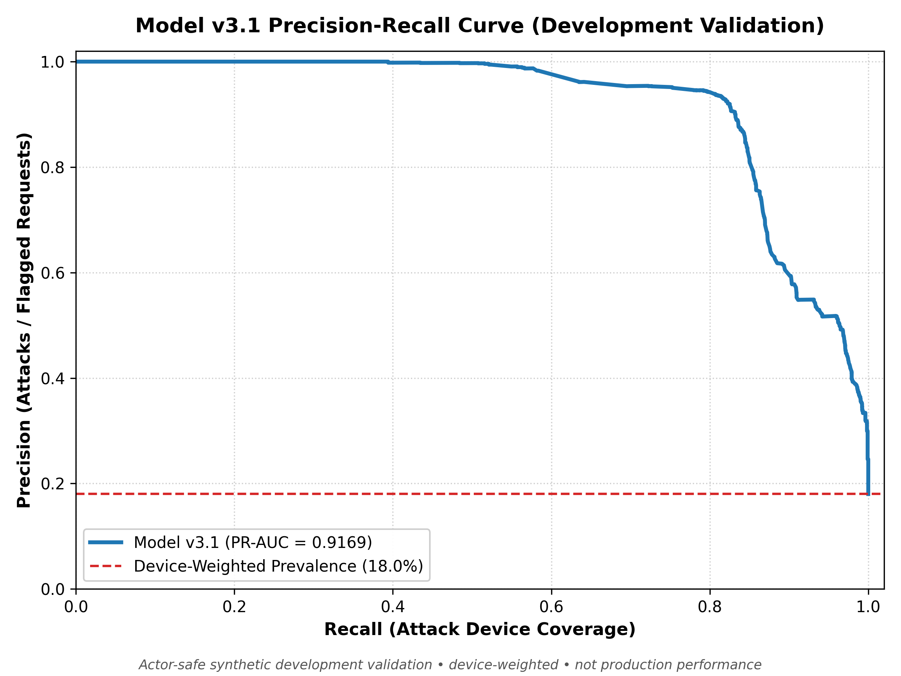
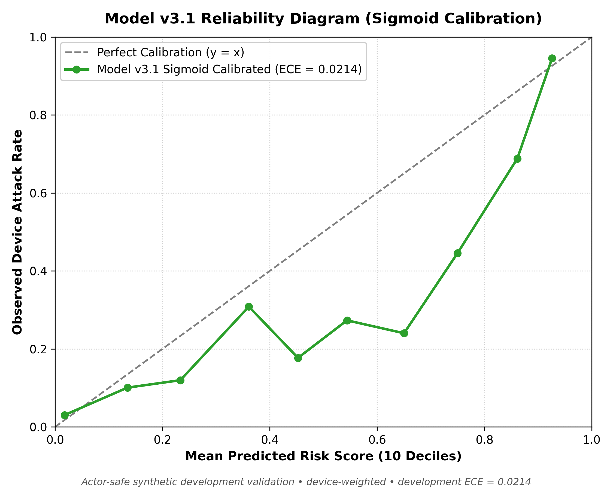
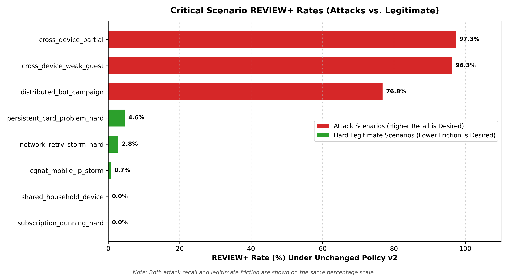
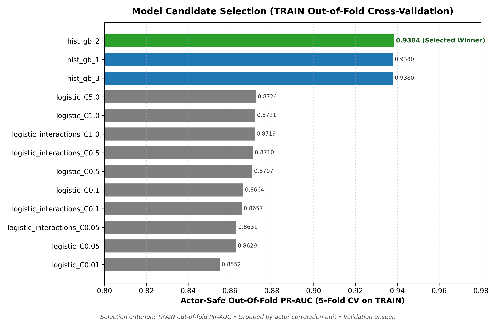
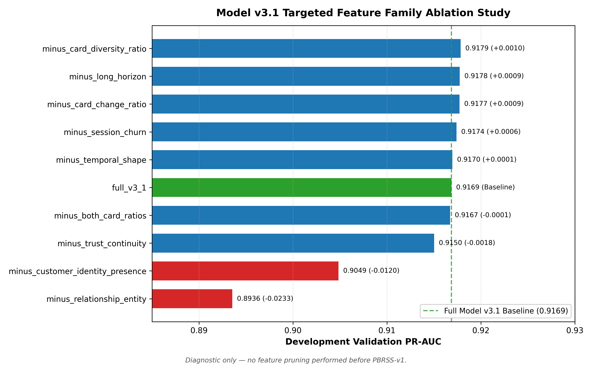

# Card-Testing Sentinel

> Stop card-testing attempts before creating a Razorpay order.

Card-Testing Sentinel is a Razorpay AI Buildathon prototype that returns
`allow`, `review`, or `block` before authorization. The active application now
uses the frozen v2 feature, model, and policy stack end to end. All training and
evaluation evidence is synthetic; it does not establish production fraud or
legitimate-customer performance.


## What runs now

The single active selection is declared in `configs/runtime.yaml`:

| Component | Active version |
|---|---|
| Runtime | `frozen-v2-runtime` |
| Feature contract | `merchant-visible-causal-2` — 39 ordered features |
| Model | `model-v2` — logistic regression, sigmoid calibration |
| Policy | `validation-selected-v2` — `evidence_gated_v2` |
| Final evaluation | Frozen `blind-v2`, consumed once |
| Local state | `data/runtime/live_state_v2.sqlite3` |

Startup validates the manifest against the feature source, committed contract
artifact, model metadata, exact model feature order, policy configuration, and
Blind v2 consumption record. A contract or version mismatch prevents readiness.
A genuinely missing or unreadable model can enter the explicitly reported
`degraded_rules_only` failover; a different feature contract cannot.

## Request and Razorpay lifecycle

```text
React checkout
    → POST /api/precheck
    → strict schema + HMAC-protected identifiers
    → FeatureEngineV2 causal snapshot (39 features)
    → frozen Model v2 score
    → frozen Policy v2 decision
    → SQLite persistence
    → ALLOW only: server creates Razorpay Test Mode order
    → Standard Checkout
    → verified signature/webhook
    → later outcome and checkout update future history
```

The current authorization result is not known at precheck time. Card metadata,
decline reasons, processor outcomes, and checkout completion arrive only in
later verified lifecycle events, so they can affect only future requests.
Exact retries return the persisted decision without rescoring. Conflicting
retries fail with HTTP 409. Razorpay order creation is suppressed for both
`review` and `block`; payment signatures and webhooks are verified server-side,
and payment state transitions are monotonic.

The v2 runtime uses a new database path rather than replaying v1 decisions under
different semantics. Existing `live_state.sqlite3` user state is left untouched.
Restart recovery rebuilds v2 state from `live_state_v2.sqlite3` and verifies
that persisted policy decisions and state versions reproduce.

## Frozen Blind v2 evidence

Blind v2 was already evaluated and consumed before this integration phase. The
runtime and evidence UI read committed aggregates only; they never regenerate,
retune, or rescore blind rows.

| Final frozen metric | Result | Target |
|---|---:|---|
| Attack devices reaching REVIEW+ | **70.5000%** | PASS |
| Attack devices reaching BLOCK | **34.1250%** | reporting |
| Legitimate devices reaching REVIEW+ | **14.9062%** | **FAIL** |
| Legitimate devices reaching BLOCK | **5.0937%** | **FAIL** |
| Model PR-AUC | **0.487127** | reporting |
| Model ROC-AUC | **0.735120** | reporting |
| Verdict | **WEAK** | — |

The evaluation contains 800 attack devices and 3,200 legitimate devices.
Subscription dunning, persistent genuine card failures, and network retry
storms are the largest legitimate-friction weaknesses. These failed results
are intentionally visible in `/api/metrics/blind` and the React Evidence page.

Blind v1.1 remains committed as historical evidence for the earlier v1 stack.
It is a different benchmark and is not presented as a like-for-like comparison
or as the final result. Exact Blind v2 raw device timelines are ignored local
generation outputs, not packaged release evidence, so `/api/replay/*` returns
`not_packaged` instead of fabricating records or silently replaying v1.

## Model v3.1 development evidence (pre-PBRSS freeze)

> **Development evidence only.** The numbers below reflect actor-safe synthetic development validation on held-out Dataset v4.1 data. They are not production performance, not real Razorpay merchant performance, and not proof of real-world generalization. The Post-Blind Remediation Stress Suite (PBRSS-v1) remains unconsumed and un-scored. The active runtime continues to serve frozen Model v2.

| Metric | Primary Product Gate | Model v3.1 Synthetic Validation | Status |
|---|---|---:|---|
| Attack devices reaching REVIEW+ | $\ge 70.0\%$ | **93.49%** (589/630) | Surpassed |
| Attack devices reaching BLOCK | diagnostic | **67.46%** (425/630) | Reporting |
| Legitimate devices reaching REVIEW+ | $\le 6.0\%$ | **3.14%** (90/2870) | Surpassed |
| Legitimate devices reaching BLOCK | $\le 1.0\%$ | **0.14%** (4/2870) | Surpassed |
| Model PR-AUC (device-weighted) | $\ge 0.70$ (stretch) | **0.9169** | Surpassed |
| Model ROC-AUC (device-weighted) | $\ge 0.85$ (stretch) | **0.9693** | Surpassed |
| Expected Calibration Error (ECE) | $\le 0.030$ (stretch) | **0.0214** | Surpassed |
| Brier score | $\le 0.080$ (stretch) | **0.0410** | Surpassed |
| Counterfactual Pair Ordering Accuracy | $\ge 90.0\%$ (stretch) | **100.0%** (20/20 pairs) | Surpassed |

### Development figures

| Precision-Recall Curve | Calibration Reliability |
|---|---|
|  |  |

| Policy v2 Operating Outcomes | Critical Scenario REVIEW+ Rates |
|---|---|
|  |  |

| Candidate Model Selection (TRAIN OOF) | Targeted Feature Ablations |
|---|---|
|  |  |

For complete development details, diagnostic ablations, and audit trails, see:
- [Phase 2.6 Model v3.1 Development Report](reports/phase_2_6_model_v3_1_development.md)
- [Phase 2.6 Model v3.1 Feature Ablation Report](reports/phase_2_6_model_v3_1_ablations.md)
- [Phase 2.6 Dataset v4.1 Audit Report](reports/phase_2_6_dataset_v4_1_audit.md)
- [Phase 2.6 Handoff Document](docs/phase_2_6_handoff.md)
- [README Figures Reproducibility Manifest](docs/figures/readme_chart_manifest.json)

## Local setup

Python 3.11 and Node 22.13.1 or newer are required.

```bash
python3.11 -m venv .venv
source .venv/bin/activate
python -m pip install --upgrade pip==26.2.1 setuptools==84.0.0
python -m pip install --no-deps -r requirements-runtime.lock
python -m pip install --no-deps -r requirements-dev.lock
python -m pip install --no-deps --no-build-isolation -e .

npm ci
npm run build

export CTS_HMAC_SECRET='replace-with-a-long-private-local-secret'
python scripts/run_app.py
```

Open `http://127.0.0.1:8000`. Keep the HMAC secret stable across restarts when
using persisted state. To enable the payment lifecycle, add Razorpay Test Mode
`RAZORPAY_KEY_ID`, `RAZORPAY_KEY_SECRET`, and `RAZORPAY_WEBHOOK_SECRET`; live-mode
key IDs are rejected.

Useful runtime checks:

```bash
curl http://127.0.0.1:8000/health/ready
curl http://127.0.0.1:8000/api/system
curl http://127.0.0.1:8000/api/metrics/blind
```

## Tests and release verification

The default clean-clone suite does not depend on ignored `data/generated/`
files. It covers the active v2 runtime, contract binding, APIs, causality,
idempotency, SQLite/restart recovery, Razorpay order guards, signatures,
webhooks, frontend behavior, and release integrity.

```bash
ruff format --check .
ruff check .
npm ci
npm run lint
npm test
npm run build
pytest --cov-report=term-missing --cov-fail-under=80
python scripts/verify_release.py
```

Tests that regenerate datasets, train candidates, run blind generators, or
depend on ignored frozen-row inputs are retained under the `slow` marker:

```bash
pytest -m slow
```

They have explicit local-data or reproducibility prerequisites and are not a
clean-clone release gate. The release verifier checks the active manifest,
Model v2 artifact and metadata, the exact 39-feature order and contract hash,
Policy v2 checksum/configuration, Blind v2 consumption and result hashes,
required sources, no-rescoring endpoint implementation, and runtime dependency
compatibility. It exits non-zero on any mismatch.

## Docker

The Dockerfile uses a Node build stage (`npm ci`, then `npm run build`) and
copies the resulting React production bundle into the non-root Python runtime.
The application therefore serves the current storefront rather than the legacy
fallback dashboard in a clean image.

```bash
docker build -t card-testing-sentinel .
docker run --rm \
  -p 8000:8000 \
  -e CTS_HMAC_SECRET='replace-with-a-long-private-local-secret' \
  -v card_testing_state:/app/data/runtime \
  card-testing-sentinel
```

The image retains `/health/ready`, runs as the `sentinel` user, and keeps the
versioned runtime database on `/app/data/runtime`.

## API summary

| Method | Route | Purpose |
|---|---|---|
| `GET` | `/health/live` | Process liveness |
| `GET` | `/health/ready` | Validated v2 readiness |
| `GET` | `/api/system` | Active versions, model/policy/evaluation status |
| `POST` | `/api/precheck` | Pre-authorization v2 decision |
| `POST` | `/api/outcomes` | Record a later verified outcome |
| `POST` | `/api/checkouts` | Record later checkout completion |
| `POST` | `/api/razorpay/orders` | Create a Test Mode order for ALLOW only |
| `POST` | `/api/razorpay/payments/verify` | Verify Standard Checkout signature |
| `POST` | `/api/webhooks/razorpay` | Verify and apply a Razorpay webhook |
| `GET` | `/api/metrics/blind` | Frozen Blind v2 aggregate evidence |
| `GET` | `/api/replay/devices` | Honest Blind v2 replay availability state |

## Limitations

- Every dataset and evaluation result is synthetic.
- The frozen verdict is `WEAK`; legitimate-friction targets failed.
- `review` is a policy state, not an implemented 3DS, OTP, or manual-review flow.
- SQLite plus one transition lock is a single-process prototype design.
- Exact Blind v2 device replay is not packaged.
- There is no production authentication, tenant isolation, distributed state,
  rate limiting, drift monitoring, or review-feedback system.
- Any safety remediation after Blind v2 must be labelled post-blind and tested
  on a new stress suite; it cannot be presented as Blind v2 evidence.

See [the API guide](docs/api.md), [deployment notes](docs/deployment.md), and
[license](LICENSE) for supporting detail.
