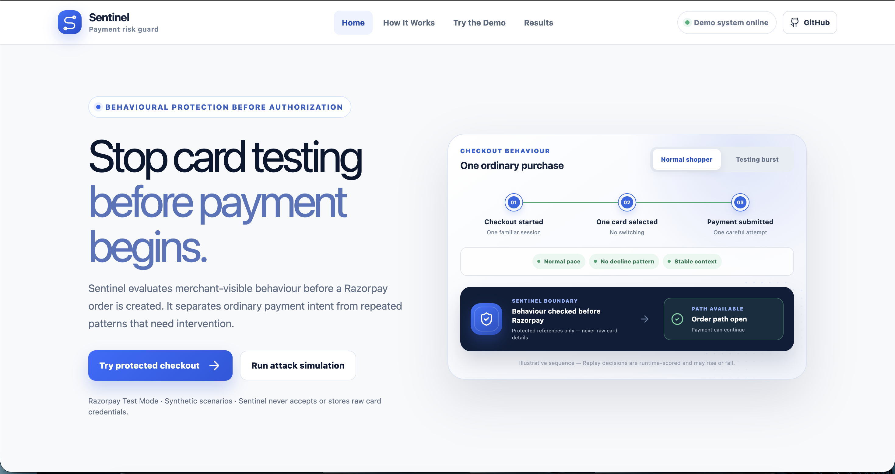
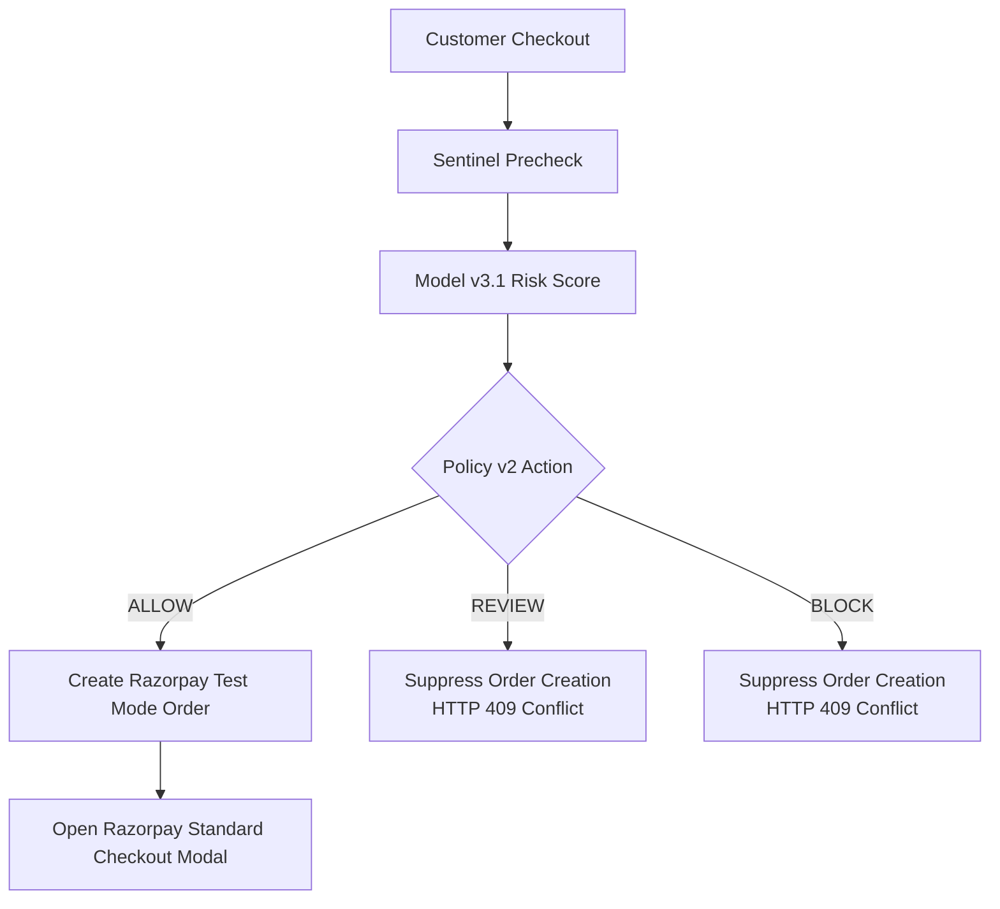
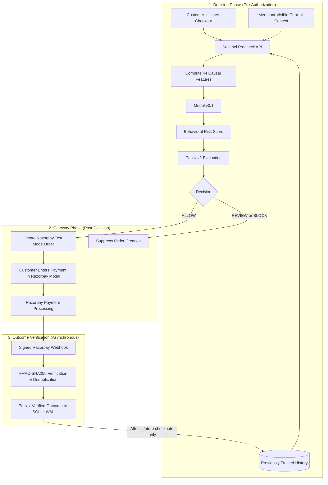
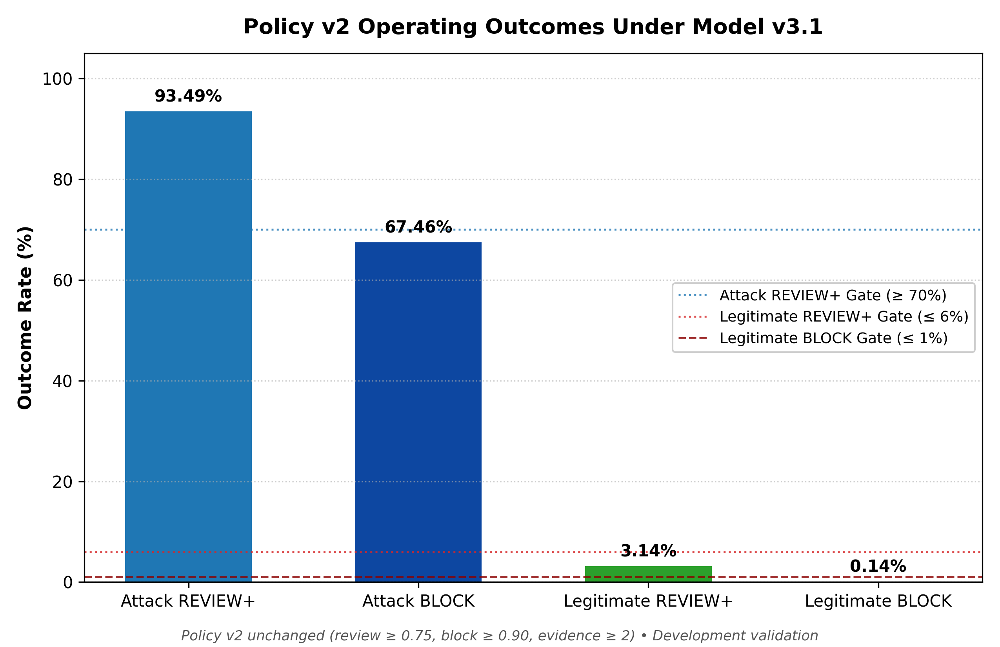
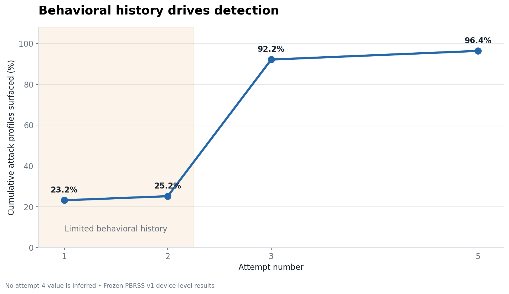

<div align="center">


# Card-Testing Sentinel

### Stop automated card testing before a Razorpay payment begins.

**Razorpay AI Buildathon 2026 — Track 02: AI Risk Manager**

<br>

<!-- Navigation buttons. When public demo/video are deployed, update destinations below. -->
<a href="https://card-testing-sentinel-production.up.railway.app/"></a>
<a href="https://youtu.be/ebA4cMxCXtY"></a>
<a href="#how-it-works"></a>
<a href="#evaluation"></a>
<a href="docs/dataset.md"></a>
<a href="reports/README.md"></a>

<br>

[](https://www.python.org/)
[](https://fastapi.tiangolo.com/)
[](https://react.dev/)
[](https://www.typescriptlang.org/)
[-0C2340?style=flat-square&logo=razorpay&logoColor=white)](https://razorpay.com/docs/)
[-orange?style=flat-square)](reports/phase_2_6_model_v3_1_development.md)
[](tests/)

**Most fraud classifiers score a transaction that already exists. Sentinel decides whether suspicious checkout behavior should reach the payment gateway at all.**

</div>

<div align="center">
  
</div>

---

## Project Snapshot

Card-Testing Sentinel is a pre-authorization behavioral risk layer. It combines merchant-visible context from the current checkout with trusted history from earlier attempts, converts that information into 44 causal behavioral signals, and decides whether Razorpay order creation should be permitted.

I chose this problem because card testing is a real merchant abuse pattern that can be automated at scale, and I wanted to explore stopping suspicious checkout behavior before payment processing begins.

| Item | Current System |
|---|---|
| **Problem** | Automated card testing |
| **Decision point** | Before Razorpay order creation |
| **Development dataset** | Dataset v4.1 |
| **Features** | 44 causal behavioral features |
| **Model** | Model v3.1 — Histogram Gradient Boosting |
| **Policy** | Policy v2 |
| **Attack `REVIEW+` recall under stress** | **96.40%** |
| **Legitimate `REVIEW+` rate under stress** | **20.72%** |
| **Legitimate `BLOCK` rate under stress** | **0.16%** |
| **Stress PR-AUC** | **0.6470** |
| **Final stress verdict** | **`MIXED`** |
| **Production ready** | **`false`** |

---

## Table of Contents

* [Project Snapshot](#project-snapshot)
* [The Card-Testing Problem](#the-card-testing-problem)
* [What Sentinel Does](#what-sentinel-does)
* [How It Works](#how-it-works)
* [Trust & Causality](#trust--causality)
* [Three Proof Layers](#three-proof-layers)
* [Why Synthetic Sequential Data?](#why-synthetic-sequential-data)
* [How the Project Evolved](#how-the-project-evolved)
* [Risk Signals & Current Model](#risk-signals--current-model)
* [Evaluation](#evaluation)
* [What Worked / What Needs Improvement](#what-worked--what-needs-improvement)
* [Merchant Economics](#merchant-economics)
* [Razorpay Integration](#razorpay-integration)
* [Reliability & Verification](#reliability--verification)
* [Limitations](#limitations)
* [Quick Start](#quick-start)
* [Documentation Directory](#documentation-directory)
* [Project Structure](#project-structure)

---

## The Card-Testing Problem

Card testing is an automated attack where fraudsters test batches of stolen card credentials to find valid cards before making larger fraudulent purchases.

Because legitimate shoppers also mistype CVVs or experience temporary bank declines, a merchant cannot block every customer whose payment fails:

```text
Normal Shopper                             Card-Testing Attacker

Card A  →  Payment fails (mistyped CVV)    Card A  →  Payment fails
Card A  →  Same-card retry                 Card B  →  Payment fails
Card A  →  Payment succeeds                Card C  →  Payment fails
                                           Card D  →  Payment fails …
```

> **A payment failure alone is not card testing. Sentinel evaluates the surrounding behavior and the sequence that follows.**

A strong current signal, such as unusual micro-value intent, can raise suspicion on the first observed checkout. Later trusted evidence—such as repeated failures, velocity, historical card switching, session churn, or network movement—can corroborate or weaken that concern. Legitimate customers also experience declines, so failure history is evidence, not a fraud label.

A genuine customer may encounter a card decline, retry, and even encounter another temporary failure while still receiving `ALLOW` decisions when the surrounding behavior remains normal.

---

## What Sentinel Does

Sentinel operates as an intelligent gatekeeper positioned between customer checkout and Razorpay order creation:

```text
Completed-transaction classification: Transaction exists → transaction features → fraud prediction
Sentinel: Checkout intent → behavioral precheck → risk score → policy action → Razorpay order only after ALLOW
```



Model v3.1 produces a behavioral risk score. Policy v2 then maps that score and any required corroborating evidence to one of three actions:

### `ALLOW`
Policy v2 permits creation of a real Razorpay Test Mode order, allowing the customer to enter payment details in the standard Razorpay checkout modal. `ALLOW` is permission to begin payment processing—not a payment approval.

### `REVIEW`
The score is elevated, but the policy may not have enough corroborating evidence for a hard block. Razorpay order creation is **suppressed** (HTTP 409 `payment_order_not_allowed`).

> **Important Boundary:** In this prototype, `REVIEW` is an automated policy state that stops order creation. It does not represent manual Razorpay merchant review, human review queues, SMS OTP, or 3D Secure step-up.

### `BLOCK`
The score is very high and accompanied by at least two qualifying behavioral evidence signals. Sentinel suppresses this attempt before Razorpay order creation; this is not a permanent customer/card ban or a decision made by Razorpay. The frozen thresholds and evidence rules are defined in [`configs/policy_v2.yaml`](configs/policy_v2.yaml).

---

## How It Works

Sentinel separates the risk decision from the payment itself:



> **Decision first. Payment later. Verified gateway outcomes affect future attempts only.**

Sentinel scores the transaction using only information visible before the payment order exists. Only `ALLOW` decisions reach the gateway. Payment results become trusted history only after the backend verifies Razorpay's signed webhook.

### How Behavior Changes Future Decisions

Sentinel does not follow a predefined `ALLOW → REVIEW → BLOCK` script. Every checkout is scored at runtime from its current observable context and the trusted history available at that moment:

* A strong current signal can produce high risk even when the device has little history. Policy v2 may still choose `REVIEW` rather than `BLOCK` when corroborating evidence is absent.
* `REVIEW` and `BLOCK` suppress order creation, so those attempts produce no payment result or current-card history.
* An `ALLOW` attempt can later add a verified success, failure, or historical card identifier—but only after a valid signed Razorpay webhook.
* A later score may rise or fall as velocity windows expire and the mix of trusted evidence changes. Failure alone is never treated as proof of attack.

The current card and current payment result are never available during their own precheck decision.

---

## Trust & Causality

The model is only allowed to use information that really exists before the decision. This prevents target leakage:

| Available to Sentinel at Decision Time | Strictly Forbidden at Decision Time |
|---|---|
| Request velocity across short and long windows | Current PAN, CVV, or card expiry |
| Prior attempt counts and timing intervals | Current card number/last4, network, type, or issuing bank |
| Current merchant, amount, device, session, IP reference, customer identifier (if present), and timing context | Current authorization outcome |
| Previously verified payment failures | Current gateway decline reason |
| Previously verified successful checkouts | Future webhook metadata |
| Historical card diversity (distinct past last4s) | Client-asserted payment status |
| Historical IP and network movement | Metadata learned after the decision |
| Previously trusted checkout context | Ground-truth fraud labels |

> **The current card and current payment result cannot influence their own current precheck.**

In standard checkout flows, the frontend receives callback notifications when a payment completes or fails. Sentinel **never** updates trusted payment history from browser callbacks because client requests can be spoofed or manipulated. Only authoritative, HMAC-SHA256-signed Razorpay webhooks (`payment.failed`, `order.paid`) processed by the backend write to live state, affecting *later* attempts only.

---

## Three Proof Layers

The project separates interactive product behavior from aggregate ML evidence:

| Proof Layer | What It Runs | What It Demonstrates |
|---|---|---|
| **Protected Checkout** | Real Razorpay Standard Checkout in Test Mode after an `ALLOW` decision | The gate executes before order creation; ordinary allowed checkouts can reach Razorpay, while `REVIEW` and `BLOCK` cannot. |
| **Replay Lab** | Seven controlled synthetic scenarios through the real `RiskService`, `FeatureEngineV3`, Model v3.1, Policy v2, and shared state transitions | Decisions are computed at runtime rather than predefined by a scenario script. Controlled synthetic outcomes are not Razorpay traffic or webhooks. |
| **Evaluation** | Frozen development and shifted-stress benchmarks | Aggregate detection, friction, precision-recall, calibration, counterfactual, and stress evidence. These results are separate from the interactive demo. |

This separation prevents a polished replay from being mistaken for model evaluation or real payment traffic.

---

## Why Synthetic Sequential Data?

Real labeled pre-authorization card-testing sequences are not readily available in public datasets, and payment data carries substantial privacy, security, and access constraints. Most public fraud datasets instead describe completed payments and often contain information learned after authorization.

Sentinel therefore uses deterministic synthetic sequences built only from information available at the decision point. Development data and shifted evaluation data were kept separate, PBRSS-v1 was frozen before its one authorized score, and no synthetic result is presented as proof of production performance.

**[Full dataset methodology → docs/dataset.md](docs/dataset.md)**

---

## How the Project Evolved

Sentinel was not built by training one model and reporting the best score. Earlier evaluations exposed weaknesses, one attempted redesign was rejected entirely, and the final system was rebuilt around stricter causal and leakage-safe methodology:

| Stage | What Happened | Why It Mattered |
|---|---|---|
| **Model v2 / Dataset v3** | Blind-v2 evaluation was **WEAK** | The linear system struggled with harder behavior and legitimate-customer friction |
| **Model v3 / Dataset v4** | **REJECTED** during audit | The audit found that related users could appear in different validation folds, some features were not grounded in real merchant information, and generation was not fully reproducible |
| **Model v3.1 / Dataset v4.1** | Methodology corrected | Related users and attack groups were kept together across splits, leakage-prone features were removed, and the model was retrained using 44 causal behavioral features |
| **PBRSS-v1** | Shifted stress result was **MIXED** | Attack coverage remained high (96.40%), but REVIEW friction (20.72%) and calibration degraded |

**The final version is better because the methodology became stricter—not because weaker results were deleted.**

* **[Full dataset evolution → docs/dataset.md](docs/dataset.md)**
* **[Full evaluation journey → reports/README.md](reports/README.md)**

---

## Risk Signals & Current Model

Sentinel uses **44 causal behavioral features** covering velocity, verified failure history, historical card diversity, identity continuity, session behavior, network behavior, timing patterns, and amount behavior:

```text
Current Checkout Context + Trusted Prior History → 44 Causal Features → Model v3.1 → Behavioral Risk Score → Policy v2 → ALLOW / REVIEW / BLOCK
```

**13 candidate models were evaluated using 5-fold actor-safe grouped cross-validation on 8,500 training devices.** Related users and attack groups were kept in the same fold so the model could not appear better by seeing similar actors during both training and validation. scikit-learn Histogram Gradient Boosting (`hist_gb_2`) won with out-of-fold PR-AUC of **0.9384** and ROC-AUC of **0.9790**. Sigmoid calibration (Platt scaling) reduced Expected Calibration Error from 0.0554 to 0.0147 with zero PR-AUC ranking loss.

**[Feature contract specification → configs/features_v3_1.yaml](configs/features_v3_1.yaml)**

---

## Evaluation

Sentinel was evaluated first on a held-out development validation split, and then on a frozen, deliberately shifted stress benchmark.

> **Definition:** `REVIEW+` indicates total intervention coverage: the proportion of devices that received either a `REVIEW` or a `BLOCK` decision.

### Development Validation vs. Shifted Stress Benchmark

| Metric | Held-Out Development (v4.1) | Shifted Stress Benchmark (PBRSS-v1) |
|---|---:|---:|
| **Evaluation Population** | 3,500 devices (630 attack / 2,870 legitimate) | 5,000 devices (1,250 attack / 3,750 legitimate) |
| **Benchmark Attack Prevalence** | 18.0% | 25.0% |
| **Attack `REVIEW+` Recall** | **93.4921%** (589 / 630) | **96.40%** (1,205 / 1,250) |
| **Attack `BLOCK` Recall** | **67.4603%** (425 / 630) | **59.12%** (739 / 1,250) |
| **Legitimate `REVIEW+` Friction** | **3.1359%** (90 / 2,870) | **20.72%** (777 / 3,750) |
| **Legitimate `BLOCK` Rate** | **0.1394%** (4 / 2,870) | **0.16%** (6 / 3,750) |
| **Ordinary Checkout Review Rate** | ~3.0% | **25.30%** (759 / 3,000) |
| **PR-AUC (Device-Weighted)** | **0.916860** | **0.646976** |
| **ROC-AUC (Device-Weighted)** | **0.969254** | **0.726189** |
| **Brier Score** | **0.041004** | **0.156037** |
| **Expected Calibration Error (ECE)** | **0.021435** | **0.140679** |
| **Benchmark Precision (`REVIEW+`)** | — | **60.80%** (1,205 / 1,982) |
| **Benchmark Precision (`BLOCK`)** | — | **99.19%** (739 / 745) |
| **Counterfactual Pair Ordering (CPOA)** | **100.0% (20 / 20 pairs)** | — |

> **Benchmark Precision Note:** The 99.19% BLOCK precision and 60.80% REVIEW+ precision are device-level, policy-level, and conditional on the synthetic benchmark's 25% attack prevalence. They are not expected production precision or a production guarantee.

> **Evaluation Discipline:** Model v3.1, the 44-feature contract, calibration, and Policy v2 were frozen before PBRSS-v1. The shifted benchmark was scored once, and no post-stress model, feature, calibration, or policy tuning was performed.

> **Closed-Loop Limitation:** PBRSS-v1 is an offline detector benchmark over generated lifecycle histories. Post-intervention trajectories should not be interpreted as a fully closed-loop production simulation.

### Evaluation Charts

<div align="center">
  <table>
    <tr>
      <td align="center" width="50%">
        <br>
        <b>Figure 1: Policy v2 Outcomes on Development Validation</b><br>
        <i>Strong separation in development: 93.49% attack recall vs. 3.14% legitimate review friction.</i>
      </td>
      <td align="center" width="50%">
        <br>
        <b>Figure 2: Cumulative Detection Across Sequential Attempts (PBRSS-v1)</b><br>
        <i>Attack detection accumulates rapidly: 92.16% of attack devices received REVIEW/BLOCK by attempt 3.</i>
      </td>
    </tr>
  </table>
</div>

---

## What Worked / What Needs Improvement

Sentinel's final evaluation verdict is **`MIXED`**. Disclosing both strengths and operational limitations is essential:

### What Worked
* **Attack coverage survived distribution shift.**
* **Most multi-attempt attacks were detected by the third attempt.**
* **Very few legitimate shoppers were hard-blocked.**
* **Counterfactual tests provide evidence that risk moves in the intended direction when declared behavioral factors change.**
* **The pre-order Razorpay boundary worked end-to-end.**

### What Needs Improvement
* **Excessive Review Friction Under Shift:** Legitimate customer review rate rose from 3.14% in development to 20.72% under stress (and 25.30% in ordinary checkout). This represents substantial customer friction and is too high for direct production checkout without automated step-up mechanisms.
* **Calibration Degradation:** ECE rose from 0.0214 to 0.1407 under distribution shift as predicted probabilities drifted upward.
* **Distributed Single-Attempt Botnets:** Attackers rotating distinct devices on every attempt avoided the multi-failure history required for hard blocks.
* **No Live Production Traffic:** The detector was evaluated on synthetic distributions; it has not been validated on live Razorpay production gateway traffic.
* **No Step-Up Challenge Flow:** The prototype suppresses order creation on `REVIEW`; an automated step-up workflow (such as SMS OTP or 3DS) is not currently implemented.

> **Final Shifted-Stress Verdict:** **`MIXED`**<br>
> **Production Ready:** **`false`**

---

## Merchant Economics

High fraud recall alone is insufficient: **a fraud detector is economically harmful if legitimate-customer friction costs more than the fraud losses it prevents**.

| Operating Scenario | Assumed Attack Prevalence | Modeled Result |
|---|:---:|---|
| **Quiet Traffic** | 0.10% | **Negative modeled value:** 20.56% review friction costs more than prevented fraud |
| **Active Campaign** | 2.00% | **Positive modeled value:** Fraud prevention savings absorb review friction costs |
| **Higher-Loss Merchant** | 0.50% | **Positive modeled value:** High fraud severity lowers break-even prevalence to 0.24% |

> **High attack recall can still be economically harmful if legitimate-customer friction costs more than the fraud losses prevented.**

*Disclaimer: All financial figures are hypothetical merchant scenario parameters designed to evaluate economic trade-offs. They are not Razorpay financial data, observed merchant savings, or guarantees.*

**[Full economic formulas and derivations → reports/phase_4d_economic_scenario_analysis.md](reports/phase_4d_economic_scenario_analysis.md)**

---

## Razorpay Integration

Sentinel integrates directly with the Razorpay API:

- [x] **Pre-Authorization Gating:** Only an `ALLOW` decision permits the backend to call `POST https://api.razorpay.com/v1/orders`.
- [x] **Order Suppression:** `REVIEW` and `BLOCK` decisions suppress order creation and return HTTP 409 (`payment_order_not_allowed`).
- [x] **Standard Checkout Modal:** Allowed orders pass `order_id` to the frontend, which launches the standard Razorpay checkout modal.
- [x] **HMAC-SHA256 Signature Verification:** Webhooks delivered to `/api/webhooks/razorpay` are verified over the raw request payload using constant-time comparison (`hmac.compare_digest`).
- [x] **Correlation & Deduplication:** Payments are linked to orders and original Sentinel precheck requests. Exact duplicate webhooks are processed idempotently.
- [x] **Lifecycle Monotonicity:** Stale gateway events cannot move a terminal payment status backward.
- [x] **Authoritative Gateway Boundary:** Browser callbacks are treated as non-authoritative; only signed webhooks update trusted history.

*Tested strictly in Razorpay Test Mode; no real payment cards were charged.*

**[Verified lifecycle evidence → reports/phase_5b_1_real_razorpay_failure_lifecycle.md](reports/phase_5b_1_real_razorpay_failure_lifecycle.md)**

---

## Reliability & Verification

### Test Suite & Cryptographic Verifiers
* **282 default Python tests passed.**
* **262 expensive deterministic dataset-regeneration tests are maintained separately.**
* **76 frontend tests passed.**
* Both release and runtime v3.1 verifiers passed.

### Local HTTP Benchmark Latency
Sequential benchmarking across 500 local loopback `/api/precheck` HTTP requests (FastAPI + Pydantic + FeatureEngineV3 + Model v3.1 + SQLite WAL):
* **Median (p50):** **33.83 ms** · **p95:** **110.73 ms** · **p99:** **183.19 ms** · **Errors:** **0 / 500 (0.0%)**<br>
*(Local benchmark measurement; not a production SLA guarantee).*

### Security & Architecture Safeguards
* **Trusted History Boundary:** Unsigned direct history-injection routes were removed; live payment history can only be updated through verified gateway events.
* **Constant-Time Verification:** Webhook signatures checked with `hmac.compare_digest` to prevent timing attacks.
* **Restart Persistence:** Persisted counters and state versions reconstruct correctly from SQLite WAL after server restarts.

---

## Limitations

Card-Testing Sentinel is an **evaluated Buildathon prototype**, not a certified production fraud platform:

1. **Synthetic Evidence Only:** All machine learning performance metrics are derived from synthetic datasets and benchmarks; no live Razorpay production gateway traffic was evaluated.
2. **Offline Stress Benchmark:** PBRSS-v1 uses generated lifecycle histories and is not a fully closed-loop simulation of post-intervention production behavior.
3. **Elevated Review Friction Under Distribution Shift:** Legitimate customer review friction reached 20.72% under shifted stress (25.30% in ordinary checkout).
4. **Probability Calibration Drift:** Expected Calibration Error increased from 0.021435 to 0.140679 under distribution shift.
5. **No Step-Up Challenge Flow:** The prototype suppresses order creation on `REVIEW`; an automated challenge mechanism (such as 3DS or SMS OTP) is not implemented.
6. **Gateway Scope:** Razorpay integration is verified in **Test Mode** only; no real payment cards were processed.
7. **Prototype Concurrency Architecture:** Persistence uses local SQLite WAL mode and an in-memory transition lock, suitable for single-instance evaluation but not distributed horizontal scaling.
8. **No Production Multi-Tenancy:** Production authentication, merchant tenant isolation, distributed rate-limiting, and drift monitoring are not implemented.
9. **Final System Status:** **`production_ready=false`** under declared evaluation governance.

---

## Quick Start

> **Live Deployment:** Explore the active demo at **[card-testing-sentinel-production.up.railway.app](https://card-testing-sentinel-production.up.railway.app/)**.

### Prerequisites
* Python 3.11+
* Node.js 22.13.1+ (or LTS)
* npm 10+

### Local Setup

```bash
# 1. Clone repository
git clone https://github.com/nirajj12/Card-Testing-Sentinel.git
cd Card-Testing-Sentinel

# 2. Set up Python virtual environment
python3.11 -m venv .venv
source .venv/bin/activate

# 3. Install pinned Python dependencies
python -m pip install --upgrade pip==26.2.1 setuptools==84.0.0
python -m pip install --no-deps -r requirements-runtime.lock
python -m pip install --no-deps -r requirements-dev.lock
python -m pip install --no-deps --no-build-isolation -e .

# 4. Install frontend dependencies and build React bundle
npm ci
npm run build

# 5. Set local secret and start server
export CTS_HMAC_SECRET='change-this-to-a-long-random-secret-for-local-use'
python scripts/run_app.py
```

Open **`http://127.0.0.1:8000`** in your browser to explore the interactive Sentinel interface.

*(Optional)* For real Razorpay Test Mode checkout, provide your test credentials:
```bash
export RAZORPAY_KEY_ID='rzp_test_...'
export RAZORPAY_KEY_SECRET='...'
export RAZORPAY_WEBHOOK_SECRET='...'
```

<details>
<summary><strong>Docker setup</strong></summary>

```bash
docker build -t card-testing-sentinel .
docker run --rm -p 8000:8000 \
  -e CTS_HMAC_SECRET='change-this-to-a-long-random-secret-for-local-use' \
  -v card_testing_state:/app/data/runtime \
  card-testing-sentinel
```

</details>

### Run Tests & Verifiers

```bash
# Run unit and integration test suite
pytest

# Run frontend tests
npm test

# Run cryptographic verifiers
python scripts/verify_release.py
python scripts/verify_runtime_v3_1.py
```

---

## Documentation Directory

| Document | Purpose |
|---|---|
| **[Simple-English Guides](docs/simple/README.md)** | A short learning path covering the product, runtime, dataset/model, and evaluation without research-report language. |
| **[Dataset & Feature Methodology](docs/dataset.md)** | Why synthetic data was necessary, Dataset v4.1 design, `leakage_group_id` partition safety, and 44 causal feature families. |
| **[Evaluation & Technical Evidence](reports/README.md)** | The complete evaluation narrative: Model v2 Blind failure, rejected Model v3, Model v3.1 results, PBRSS stress benchmark, and full report index. |
| **[System Architecture](docs/architecture.md)** | Pre-authorization decision boundary, payment state machine, and webhook verification. |
| **[API Specification](docs/api.md)** | Detailed endpoint request/response contracts, status codes, and error formats. |
| **[External Dataset Assessment](docs/external_card_testing_dataset_assessment.md)** | Analysis of why common public fraud datasets are poorly suited to pre-authorization card testing. |

---

## Project Structure

```text
Card-Testing-Sentinel/
├── frontend/                     React 19 TypeScript application
├── src/card_testing_sentinel/    Core runtime (FastAPI, feature engine, ML, policy)
│   ├── api/                      REST endpoints and webhook routes
│   ├── features/                 Causal feature extractors (v3.1)
│   ├── ml/                       Model inference and calibration
│   ├── policy/                   Policy v2 decision logic
│   └── service.py                RiskService orchestration & persistence
├── configs/                      Versioned contracts (features, datasets, runtime)
├── artifacts/                    Committed frozen models, figures, and manifests
├── pipelines/                    Deterministic dataset and training generators
├── scripts/                      Release verifiers, audits, and latency benchmarks
├── tests/                        Python unit, integration, and security test suites
├── docs/                         Tier-2 architecture, dataset, and API documentation
│   ├── dataset.md                Authoritative Final Dataset Story
│   ├── architecture.md           Decision boundary and state model
│   └── api.md                    REST API specifications
├── reports/                      Tier-2 Final Evaluation Story and Technical Evidence Index
│   └── README.md                 Evaluation journey and complete report directory
└── archive/                      Quarantined historical experiments (rejected Model v3)
```

---

## Conclusion

Card-Testing Sentinel demonstrates a straightforward payment-risk principle:

> **Make the risk decision before Razorpay order creation, learn only from authoritative gateway outcomes after payment lifecycle completion, and evaluate both fraud detection and legitimate-customer cost under distribution shift.**

---

## Author

**Niraj Kumar**<br>
[GitHub](https://github.com/nirajj12) · [LinkedIn](https://www.linkedin.com/in/niraj-kumar-8255111b8/)
