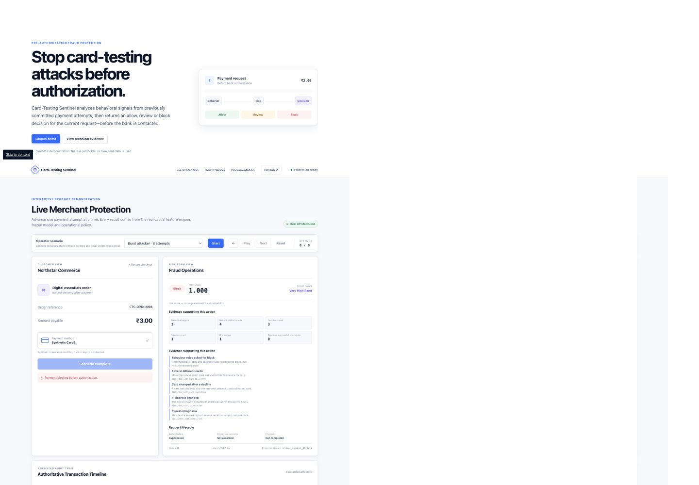

# Card-Testing Sentinel

> Stop card-testing attacks before authorization.

## Problem

Card testing uses small, repeated payment attempts to discover which stolen credentials remain valid, creating processor costs, noisy declines, customer friction and downstream fraud. Card-Testing Sentinel is a Razorpay AI Buildathon demonstration that returns `allow`, `review` or `block` before the current request reaches the bank.

## Product demo

[Live demo: deployment pending explicit approval](#local-setup)



Additional verified viewports: [1024 × 900](docs/screenshots/live-protection-1024.png), [768 × 900](docs/screenshots/live-protection-768.png), and [390 × 844](docs/screenshots/live-protection-390.png).

Quick start on Python 3.11:

```bash
python3.11 -m venv .venv && source .venv/bin/activate
python -m pip install --upgrade pip==26.2.1 setuptools==84.0.0
python -m pip install --no-deps -r requirements-runtime.lock
python -m pip install --no-deps --no-build-isolation -e .
CTS_HMAC_SECRET='replace-with-a-long-private-local-secret' python scripts/run_app.py
```

> **Synthetic-data disclosure:** no Razorpay, merchant or cardholder data was used. Every scenario, training row and evaluation result is synthetic.

## Headline results

Synthetic blind-evaluation results:

| Verified result | Value |
|---|---:|
| Attacker devices reaching review or higher | **90.33%** |
| Attacker devices blocked | **77.67%** |
| Legitimate devices reviewed | **2 of 1,700** |
| Legitimate devices blocked | **0 of 1,700** |

## How it works

1. Receive a strict raw pre-authorization request.
2. Build 44 causal behavioral features from previously committed events.
3. Apply the frozen calibrated model and deterministic stateful policy.
4. Return `allow`, `review` or `block` for the current attempt.
5. Persist the request, then record any later processor outcome and checkout completion as separate lifecycle events.

The demonstration additionally proves:

- The current authorization request is scored before its processor outcome exists.
- The browser sends no feature vector, risk score, label or scenario metadata to the model.
- Device, session, card and IP references are HMAC-protected before state or persistence.
- A blocked request is suppressed, so the bank is not contacted and no outcome is created.
- Later requests continue to be independently scored after an earlier block.
- Exact retries return the original decision and state version without rescoring.
- Changed retries and impossible lifecycle transitions fail with HTTP 409.
- Frozen blind-evaluation rows are displayed as read-only evidence and are never rescored.

The LLM is not part of the fraud-decision path. Decisions come from the frozen model, causal feature engine, deterministic rules and operational policy.

## Architecture

```text
Raw lifecycle event
        │
        ▼
Strict Pydantic contract ── rejects credentials, labels and client features
        │
        ▼
HMAC identifier boundary ── device / session / card / IP domains
        │
        ▼
Causal state engine ── 44 server-side behavioral features
        │
        ├── frozen logistic model + isotonic calibration ── risk score
        └── deterministic behavioral rules
        │
        ▼
Stateful operational policy ── allow / review / block
        │
        ▼
SQLite WAL persistence ── idempotency / audit / restart reconstruction
```

An authorization request is validated and protected before it reaches the feature engine. Features are computed from prior committed state plus values already known on the current request. The model and policy run before request state is committed. Processor outcomes and checkout completions arrive later and can affect only future requests.

One asynchronous transition lock preserves global order in this single-process prototype. SQLite uses WAL, full synchronous writes, foreign keys, unique lifecycle constraints and explicit transactions. Startup reconstructs state by replaying sanitized persisted events and verifies historical decisions and state versions.

## Live request lifecycle

The system accepts three event types:

1. `authorization_request` — scored immediately before authorization.
2. `authorization_outcome` — later `approved` or `declined` processor result.
3. `checkout_completion` — later completion linked to an approved request.

The request and outcome separation is the central leakage control. A request cannot contain `authorization_result`, labels, scenario names, client-computed features, PAN, CVV or expiry. Outcomes cannot cross device/session boundaries. A checkout must link to an existing approval. Blocked requests reject outcomes and checkouts because no authorization was sent.

Every normalized lifecycle payload receives a SHA-256 digest. Repeating the same request or transition returns the stored result with `idempotent_replay: true`; it does not recompute features, call the model, duplicate a timeline row or advance state. Reusing an identifier with changed content returns HTTP 409.

SQLite stores requests and later lifecycle events with uniqueness constraints, WAL journaling, `synchronous=FULL` and foreign keys. Restart recovery replays sanitized stored transitions and checks that decisions and state versions reproduce. Demo reset clears only the browser/demo cursor—persisted audit history remains intact.

## Dataset and scenarios

All training, validation and blind-evaluation evidence in this repository is synthetic. No Razorpay, merchant or cardholder data was used. Results therefore demonstrate implementation discipline on the generated behavior families; they do not establish production detection or false-positive performance.

The deterministic development generator creates 10,000 devices:

| Scenario | Devices | Intended behavior |
|---|---:|---|
| Normal standard | 6,000 | Ordinary purchases and low retry activity |
| Normal bad luck | 500 | Genuine customers experiencing repeated declines |
| Flash standard | 1,500 | Campaign traffic and quick same-card retries |
| Flash hard retry | 500 | More aggressive legitimate retries under load |
| Burst attack | 600 | Seconds-scale card testing with rapid card rotation |
| Evasive attack | 450 | Selective card/session/IP rotation and mixed pauses |
| Patient attack | 450 | Hours-scale attempts spread across sessions |

Devices—not rows—are assigned to train or validation partitions. With the configured 20% validation fraction, the development split contains 8,000 training devices and 2,000 validation devices. Batch feature creation replays each partition with isolated fresh state.

The separate frozen blind set contains 2,000 devices and 12,205 lifecycle events:

| Scenario | Devices |
|---|---:|
| Normal standard | 1,200 |
| Normal bad luck | 100 |
| Flash standard | 300 |
| Flash hard retry | 100 |
| Burst attack | 120 |
| Evasive attack | 90 |
| Patient attack | 90 |

Its identifiers have zero overlap with development, fresh-validation and confirmation datasets according to the frozen integrity evidence.

## Causal features

The ordered model contract contains 44 numeric features:

- Request and processed velocity over seconds, minutes, hours and days.
- Distinct cards and BINs across multiple windows.
- Cross-session card diversity and session persistence.
- Prior decline streaks and decline ratios.
- Attempts before and after the first approval.
- Device age, session age and inter-attempt timing.
- IP sharing, IP changes and IP-rotation behavior.
- Same-card retries and card switching after declines.
- Current amount, amount deltas, variation and 30-day continuity.
- Near-minimum transaction behavior.
- Prior successful checkouts and completion lag.
- Explicit flash-sale campaign context.

Labels, population, subtype, scenario, split, outcome, raw device/session identifiers and token fingerprints are forbidden model inputs. Undefined long-history behavior uses explicit numeric semantics and availability indicators rather than future information.

## Model, calibration and policy

### Model comparison and selection

Training evaluates six candidates using five deterministic device-grouped folds:

- Logistic regression with `C ∈ {0.1, 1.0, 10.0}`.
- Histogram gradient boosting with three learning-rate/leaf/regularization configurations.

Training weights balance legitimate and attack device classes. Evaluation weights give every device equal total mass, preventing devices with many attempts from dominating metrics. Calibration devices are isolated from base-model fit devices, and each outer fold reports zero pairwise device overlap.

The selected candidate is logistic regression with `C=10` and `max_iter=500`. The selection considered integrity gates, worst-subtype coverage at the primary intervention budget, macro subtype coverage, device-weighted PR-AUC, Brier score and inference simplicity. The saved metadata records 21,338 complete out-of-fold authorization predictions.

### Calibration

The pipeline compares no calibration, sigmoid calibration and isotonic calibration on isolated devices. Isotonic calibration was selected during development and is stored in the same immutable Joblib artifact as the base estimator.

The blind set provides an important honest caveat: calibration did not improve every unweighted diagnostic on this distribution.

| Blind authorization-row diagnostic | Raw | Isotonic-calibrated |
|---|---:|---:|
| ROC-AUC | 0.9263 | 0.9259 |
| PR-AUC | 0.9428 | 0.9343 |
| Brier score | 0.1055 | 0.1137 |
| ECE, 10 bins | 0.0553 | 0.0894 |
| Log loss | 0.3418 | 0.3925 |

For that reason, the production-facing output is always called a **risk score**, not a guaranteed fraud probability.

### Frozen operational policy

The selected policy is `persistent_ml`:

- Review after three recent scores at or above `0.50`.
- Block after four recent scores at or above `0.60`.
- Retain up to 16 recent request scores.
- Use a 336-hour high-risk window.
- Review when deterministic rule score reaches 5.
- Block when deterministic rule score reaches 6.

Rules corroborate rapid request velocity, processed velocity, card diversity, decline streaks, card switching after decline, multi-session persistence, shared-IP intensity and low-value behavior with diversity. Successful checkouts, stable same-card retries, time decay and campaign adjustments are supported policy mechanisms. A device is never permanently banned: every later request still receives an independent decision.

## Blind evaluation

The frozen blind evaluation includes 1,700 legitimate devices and 300 attacker devices. All 5,254 generated authorization requests received exactly one decision.

| Headline result | Frozen value |
|---|---:|
| Attacker devices reviewed or blocked | 271 / 300 — **90.33%** |
| Attacker devices blocked | 233 / 300 — **77.67%** |
| Legitimate devices reviewed | 2 / 1,700 — **0.12%** |
| Legitimate devices blocked | 0 / 1,700 — **0.00%** |

### Attacker subtype results

| Behavior | Reviewed or blocked | Blocked | Never detected |
|---|---:|---:|---:|
| Burst | 120 / 120 | 113 / 120 | 0 |
| Evasive | 79 / 90 | 65 / 90 | 11 |
| Patient | 72 / 90 | 55 / 90 | 18 |

### Detection by attempt

| Requests scored through attempt | Reviewed or blocked | Blocked |
|---:|---:|---:|
| 1 | 0 / 300 | 0 / 300 |
| 3 | 0 / 300 | 0 / 300 |
| 5 | 171 / 300 | 2 / 300 |
| 10 | 271 / 300 | 233 / 300 |

Median first review occurred at attempt 5. Median first block occurred at attempt 7. Twenty-nine of 300 attackers were never detected. The saved count of 760 later attempts after first block is an offline upper bound, not observed or causal fraud prevention.

## False-positive cost

Only two normal-bad-luck devices reached review. No normal-standard, flash-standard or flash-hard-retry device reached review, and no legitimate device was blocked. Every frozen safety budget passed. Review is still operational work and customer friction, so the relevant cost is not hidden behind an aggregate rate: two genuine synthetic customers would have required intervention.

## Latency benchmark

The optimized runtime scorer extracts the frozen imputer, scaler, logistic coefficients and isotonic thresholds once at startup. It avoids per-request DataFrame construction and retains golden-fixture parity with the serialized scikit-learn artifact.

Run the local repeatable API benchmark with:

```bash
python scripts/benchmark.py
```

The benchmark uses a non-blind 44-feature golden fixture for model-only timing and a fresh temporary SQLite database for real `POST /api/precheck` traffic. The end-to-end boundary includes Pydantic validation, HMAC protection, state loading, causal features, model, isotonic calibration, policy, SQLite persistence, middleware, serialization and response. It is an in-process ASGI HTTP measurement, so it excludes remote network and payment-processor latency.

Model-only results used 2,000 warmups and 20,000 measurements per component:

| Prepared-array path | p50 | p95 | p99 | Mean | Maximum | Throughput |
|---|---:|---:|---:|---:|---:|---:|
| Raw logistic output | 0.0015 ms | 0.0015 ms | 0.0016 ms | 0.0015 ms | 0.0667 ms | 676,782/s |
| Isotonic calibration | 0.0012 ms | 0.0013 ms | 0.0013 ms | 0.0012 ms | 0.0258 ms | 843,492/s |
| Policy decision | 0.0306 ms | 0.0335 ms | 0.0525 ms | 0.0347 ms | 33.5513 ms | 28,814/s |
| Combined model + calibration + policy | **0.0372 ms** | **0.0410 ms** | **0.0625 ms** | **0.0409 ms** | **41.9929 ms** | **24,442/s** |

End-to-end warm-request results used 20 valid warmup requests and unique request identifiers:

| Traffic | Requests | p50 | p95 | p99 | Mean | Maximum | Sequential throughput | Failures |
|---|---:|---:|---:|---:|---:|---:|---:|---:|
| Normal customer | 250 | 2.643 ms | 4.404 ms | 4.838 ms | 3.054 ms | 5.879 ms | 327.5/s | 0 |
| Burst attack | 320 | 2.957 ms | 4.852 ms | 5.443 ms | 3.456 ms | 34.639 ms | 289.4/s | 0 |
| Mixed | 250 | 2.966 ms | 4.905 ms | 5.043 ms | 3.413 ms | 5.165 ms | 293.0/s | 0 |

Cold startup through readiness was 342.914 ms. A separately labelled 500-request idempotent-retry run measured 1.527 ms p50, 2.519 ms p95 and 2.702 ms p99 with zero rescoring and exact original decision/state preservation. Artifacts loaded once, blind-row load count and per-request DataFrame construction count were both zero, and the temporary database reported WAL with `quick_check = ok`. Results vary with hardware and should be regenerated on the deployment target. Full methodology is in [`scripts/benchmark.py`](scripts/benchmark.py).

## Privacy and security design

- Strict Pydantic schemas reject extra fields and future outcome information.
- Device, session, card and IP values use domain-separated HMAC-SHA256.
- PAN, CVV and expiry are never accepted by the API or demo UI.
- The HMAC secret must contain at least 16 characters and is never persisted.
- Response projections omit raw identifiers, internal thresholds and the full feature vector.
- The operations UI receives only six allowlisted causal signals.
- Unknown reason codes fail closed rather than receiving invented explanations.
- Content Security Policy, frame denial, MIME sniffing prevention and no-referrer headers are set on every response.
- Frontend rendering uses `textContent`/DOM construction, not untrusted HTML insertion or dynamic evaluation.
- The release manifest protects the model, calibrator, feature contract, policy, evaluation evidence and application configuration.
- Runtime dependency compatibility is checked before Joblib deserialization.

The prototype has no authentication, authorization or rate limiting; those are required before any production exposure.

Dependency scanning on August 26, 2026 found no npm vulnerabilities. The Python audit improved from 51 advisory records across 10 packages to zero known vulnerabilities in the clean patched environment. Web-facing FastAPI, Starlette, Jinja2, Uvicorn and h11 were upgraded together; frozen scikit-learn, NumPy, SciPy and Joblib versions were not changed. The complete package-by-package classification is in [`reports/dependency_security_audit.md`](reports/dependency_security_audit.md).

## Reproducibility and frozen hashes

Python 3.11 is required. The model artifact requires the exact recorded NumPy, SciPy, Joblib and scikit-learn versions; startup fails closed on mismatch.

<details>
<summary>Protected release hashes</summary>

| Protected release item | SHA-256 |
|---|---|
| Model plus fitted isotonic calibrator | `6c638fc05ca321e98c8b5417c477a58e2649bdd7e056bcd56e0d119d3eb80f88` |
| Feature contract | `40ba9345c649a91cad9805b2d48b9607e9c179b042e70a682e71958e2d9bb634` |
| Model metadata | `98160e5f03c58fc9a5c442ecbf9b847dc56e70501543e9b1a279bb738bde98a2` |
| Operational policy | `9afeba2df176c87287e86ff0402ef96b58e9386608d003b5702986be02b6ae95` |
| Blind metrics | `5fba17e8a8458c290934dece38ef70ef28d5b6eed93709ba9b8f3950a3130ef6` |
| Blind device summary | `b5c6a7ff1e925dfeff66d815b39bcc9716be06239e4d1276e931fd798c7f1a55` |
| Blind event decisions | `e6e6b2481c09edb44c1782165b97c5c59864890fd03ddbfdb991b1ec41605817` |
| Release manifest | `919a81a49c75b6b9ddf0697782357994752a9c5c0cdca1a9aaacb3594eea248b` |

</details>

Verification:

```bash
python scripts/verify_release.py
```

The command checks the manifest checksum, every protected byte, the ordered 44-feature contract and model/runtime compatibility. It reports `blind_rows_rescored: False`.

<details>
<summary>Tests and coverage</summary>

```bash
ruff format --check .
ruff check .
npm test
pytest --cov-report=term-missing --cov-fail-under=80
python scripts/verify_release.py
```

The Python suite covers strict API contracts, lifecycle causality, concurrency, idempotency, conflicts, post-block scoring, HMAC storage, SQLite WAL, restart recovery, artifact tampering, dependency compatibility, golden 44-feature/score parity, demo orchestration, dashboard safety and the development ML pipeline.

The Node/jsdom suite imports the exact browser modules served by FastAPI and verifies customer/operations separation, the six-signal allowlist, three-decimal risk display, fail-closed reason explanations, idempotent replay disclosure and exact blocked lifecycle text.

CI enforces a minimum whole-repository Python coverage of 80%.

The August 26, 2026 final verification ran **112 Python tests with 91.58% total coverage** and **15 browser-module tests**, with all tests passing. Ruff formatting and lint checks also passed. The suite fails immediately if a protected blind-row CSV is opened.

</details>

<details>
<summary>Development-only reproducibility pipeline</summary>

The following commands create development-only outputs and never read or replace saved blind evidence:

```bash
python pipelines/generate_synthetic_data.py
python pipelines/build_features.py
python pipelines/validate_dataset.py
python pipelines/analyze_training_data.py
python pipelines/train_model.py
python pipelines/evaluate_model.py
```

</details>

## Limitations

- The dataset and every evaluation result are synthetic.
- The risk score is not certainty or a guaranteed probability of fraud.
- Twenty-nine of 300 blind attacker devices were never detected.
- No blind attacker was detected during the first three attempts.
- Patient and evasive attacks remain harder to detect than burst attacks.
- SQLite plus a global transition lock makes this a single-process prototype.
- The offline potentially-preventable count is not observed fraud prevention.
- The LLM is not used to make fraud decisions.
- There is no production authentication, authorization, tenant isolation, rate limiting or secret manager integration.
- There is no distributed state or model-drift monitoring.
- Production use requires merchant validation, partitioned transactional state, durable streaming, distributed idempotency, state migrations, monitoring, alerting, review feedback and formal audit controls.

## Local setup

```bash
python3.11 -m venv .venv
source .venv/bin/activate
python -m pip install --upgrade pip==26.2.1 setuptools==84.0.0
python -m pip install --no-deps -r requirements-runtime.lock
python -m pip install --no-deps --no-build-isolation -e .
export CTS_HMAC_SECRET='replace-with-a-long-private-local-secret'
python scripts/run_app.py
```

Open `http://127.0.0.1:8000`. Keep the same HMAC secret across restarts if persisted identity continuity is required.

Docker is the canonical deployment-shaped runtime:

```bash
docker build -t card-testing-sentinel .
docker run --rm \
  -p 8000:8000 \
  -e CTS_HMAC_SECRET='replace-with-a-long-private-local-secret' \
  -v card_testing_state:/app/data/runtime \
  card-testing-sentinel
```

See [deployment preparation](docs/deployment.md) for the single-instance SQLite, persistent-volume, health-check and hosting constraints. No external deployment has been authorized.

## API reference

| Method | Route | Purpose |
|---|---|---|
| `GET` | `/health/live` | Process liveness |
| `GET` | `/health/ready` | Verified runtime readiness |
| `GET` | `/api/system` | Safe runtime and storage status |
| `POST` | `/api/precheck` | Score a raw authorization request |
| `POST` | `/api/outcomes` | Record a later processor outcome |
| `POST` | `/api/checkouts` | Record a completed approved checkout |
| `GET` | `/api/runtime/decisions` | Sanitized recent live decisions |
| `GET` | `/api/runtime/devices/{device_id}/timeline` | Sanitized live lifecycle timeline |
| `GET` | `/api/metrics/blind` | Frozen blind headline evidence |
| `GET` | `/api/replay/devices` | Filter immutable blind device rows |
| `GET` | `/api/replay/devices/{device_id}/timeline` | Immutable blind decision timeline |

See [docs/api.md](docs/api.md) for request examples and transition rules.

## License

See [LICENSE](LICENSE).
