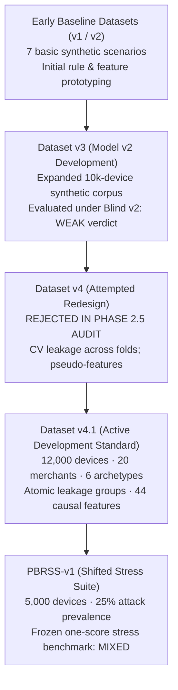

# Dataset and Feature Methodology

Card-Testing Sentinel is a pre-authorization behavioral risk layer for Razorpay Checkout. Because Sentinel makes its decision **before** a payment order is created, its training and evaluation data must represent what a merchant can observe at that exact decision point.

This document explains Sentinel's dataset methodology: why synthetic data was needed, the causal rule governing payment information, how earlier versions failed and evolved, how Dataset v4.1 prevents data leakage, and where the detailed evidence lives.

---

## 1. Why a Synthetic Dataset?

The decision to use deterministic synthetic data was driven by payment architecture rather than convenience.

Common public fraud datasets (such as Kaggle credit card benchmarks) are usually poorly suited to this specific pre-authorization problem because they often describe completed transactions and lack the multi-attempt device, session, and history signals Sentinel needs. Many public records also include post-processing information—such as bank authorization decline codes or settlement outcomes—that cannot exist before payment collection begins.

Card-testing detection requires something fundamentally different: **multi-attempt temporal sequences** evaluated before payment details are collected:

```text
Checkout attempt
  → Previously verified history
  → Device / session / customer / network state
  → Pre-decision causal features
  → Risk decision (ALLOW / REVIEW / BLOCK)
  → (If ALLOW) Razorpay payment attempt
  → Verified gateway outcome (signed webhook)
  → Trusted history for future attempts
```

Public datasets also generally lack the device continuity, cross-attempt card diversity, and session dynamics needed to distinguish:
* A legitimate customer retrying a failed card after mistyping a CVV, versus
* An automated card-testing bot systematically cycling through stolen card numbers.

For this Buildathon prototype, a deterministic synthetic corpus was engineered to model these multi-attempt behavioral patterns across multiple merchant business models. A detailed comparison is documented in [Why common public fraud datasets are poorly suited to this problem](external_card_testing_dataset_assessment.md).

---

## 2. The Causal Data Rule

The most critical architectural constraint of Card-Testing Sentinel is that **the current payment must never influence its own risk decision**:

> **The Causal Data Rule:** Payment outcomes and safe card metadata become historical information only after the corresponding payment lifecycle completes. They can affect later attempts, never the decision that preceded them.

The dataset strictly enforces this temporal boundary between precheck time and outcome time:

| Available Before Decision | Strictly Forbidden at Decision Time |
|---|---|
| Request velocity across short and long windows | Current PAN, CVV, or card expiry |
| Prior attempt counts and timing intervals | Current card network, type, or issuer |
| Device, customer, and session history | Current authorization result |
| Previous verified payment failures | Current gateway decline reason |
| Previous verified successful checkouts | Future webhook metadata |
| Historical card diversity (from past settled/failed attempts) | Any client-asserted payment outcome |
| Historical network and IP dynamics | Metadata learned after the decision |
| Current transaction amount and merchant context | Ground-truth scenario labels |

Safe card metadata (such as masked last4 and card network) and gateway decline reasons enter a device's behavioral history only after an authoritative, cryptographically signed Razorpay webhook completes the payment lifecycle.

---

## 3. Dataset Evolution

The dataset evolved through several iterations as later evaluations exposed problems in the dataset design and data leakage risks:



### Early Baseline Datasets (v1 & v2)
* Early prototypes modeled basic synthetic traffic across seven simple scenarios (such as normal ecommerce checkouts and high-velocity burst card probes).
* Used to bootstrap initial feature extraction and verify local database persistence.

### Dataset v3 — Stronger Behavioral Corpus
* Expanded synthetic dataset used to train Model v2 (regularized logistic regression, 39 features) and select Policy v2.
* Evaluated under the frozen **Blind v2** evaluation (4,000 devices: 800 attack, 3,200 legitimate).
* Blind v2 exposed important weaknesses: attack review recall was only 70.50% and legitimate customer review friction reached 14.91% (`WEAK` verdict). This showed that simple linear models struggled with patient, distributed, and camouflaged card-testing patterns.

### Dataset v4 — Rejected Redesign (`REJECTED / HISTORICAL`)
* Conceived after Blind v2 to enrich complex attack behaviors.
* During the Phase 2.5 independent audit ([`phase_2_5_model_v3_audit.md`](../archive/reports/phase_2_5_model_v3_audit.md)), critical flaws were uncovered:
  * **Cross-Validation Fold Leakage:** CV splitting was applied to `(customer_id, device_id)` pairs instead of correlated actors. Out of 803 multi-device actors, 382 straddled across folds, allowing models to memorize actor characteristics.
  * **Ungrounded Pseudo-Features:** Heuristic ratios like `merchant_relative_velocity_zscore` and `merchant_amount_log_ratio` were hardcoded without true merchant baseline context.
  * **Generator Inconsistencies:** Declared behaviors (household identity rotation, network instability) were not reflected in emitted data, and timestamps were non-deterministic.
* **Decision:** Dataset v4 and Model v3 were formally **rejected** and moved to [`archive/`](../archive/).

### Dataset v4.1 — Current Development Dataset (`CURRENT DEVELOPMENT DATASET`)
* Developed in Phase 2.6 as the corrected development standard ([`phase_2_6_dataset_v4_1_audit.md`](../reports/phase_2_6_dataset_v4_1_audit.md)).
* Corrected all Phase 2.5 findings:
  * Established group-safe `leakage_group_id` partitioning.
  * Replaced pseudo-features with 44 strictly causal merchant-visible features (`merchant-visible-causal-3.1`).
  * Enforced byte-deterministic generation (the same configuration and seed generate the same dataset across all splits).

---

## 4. The Evaluation Hierarchy: Dataset v4.1 vs. PBRSS-v1

It is vital to distinguish the role of the development corpus from the stress benchmark:

```text
Dataset v4.1 (Development & Held-Out Validation)
  → 12,000 devices across 20 merchants
  → 8,500 train devices (5-fold actor-safe CV)
  → 3,500 held-out validation devices
  → Model candidate selection, calibration, and policy validation
  → Model v3.1, 44 features, and Policy v2 FROZEN

THEN (Strict One-Score Governance)

PBRSS-v1 (Post-Blind Remediation Stress Suite v1)
  → 5,000 independent devices under distribution shift
  → 25% synthetic benchmark attack prevalence
  → Scored once without retraining or post-stress tuning
  → Final prototype verdict: MIXED
```

* **Dataset v4.1** is the development corpus used to select, calibrate, and validate Model v3.1.
* **PBRSS-v1** is a separate, deliberately shifted stress suite designed to test how the frozen model handles harder, unfamiliar evasion patterns. The stress test was run once on frozen models and was not used to tune thresholds.

---

## 5. Dataset v4.1 Structure and Diversity

Dataset v4.1 models **12,000 total devices** across **20 distinct merchants** representing six business archetypes:

### Merchant Archetypes
| Merchant Type | Weight | Why It Is Included |
|---|:---:|---|
| **Standard E-Commerce** | 5 merchants | Balanced transaction sizes (INR 800–3,500), moderate returning customers (30–50%), and standard checkout flows. |
| **Guest-Heavy** | 4 merchants | Frequent guest checkouts (75% unauthenticated), lower returning rates, and higher shared-IP concentration. |
| **Subscription / SaaS** | 3 merchants | High login affinity (98%), consistent recurring billing, and legitimate subscription dunning retry cycles. |
| **Micro-Payment** | 3 merchants | Very low transaction values (INR 19–299), wide amount spread, and high baseline transaction frequency. |
| **Flash Sale** | 3 merchants | Extreme transaction bursts during promo campaigns, heavy shared-IP traffic (25–55%), and lower base success rates. |
| **High Ticket** | 2 merchants | Large transaction amounts (INR 8,000–75,000), low purchase frequency, and high fraud sensitivity. |

*Exact generator configurations and parameters are defined in [`configs/dataset_v4_1.yaml`](../configs/dataset_v4_1.yaml).*

### Legitimate Behavioral Patterns
To avoid training models that treat every payment failure as fraud, Dataset v4.1 incorporates difficult legitimate failure modes:
* **Genuine Retries:** Shoppers retrying the same card after mistyping a CVV or hitting temporary issuer limits.
* **Subscription Dunning:** Automated recurring payment retries following expired cards or bank declines.
* **Network Retry Storms:** Rapid retries triggered by mobile connectivity drops or client-side app retries.
* **Shared Household Devices:** Multiple family members with distinct cardholder names checking out on a shared tablet or laptop.
* **Carrier-Grade NAT (CGNAT):** Hundreds of distinct mobile shoppers sharing a small pool of cellular IP addresses.

### Attack Behavioral Patterns
Dataset v4.1 models diverse automated card-testing tactics:
* **Rapid Burst Testing:** High-frequency script testing of sequential stolen cards.
* **Patient / Slow Drip Testing:** Attacks spaced over hours or days to bypass simple sliding-window velocity counters.
* **Card Churn After Declines:** Automated switching to a fresh card immediately following a decline.
* **Session Churn:** Continuously discarding and recreating checkout sessions to simulate new visitors.
* **Partial Identity Rotation:** Cycling email addresses and customer names while reusing underlying device fingerprints or IP ranges.
* **Distributed Bot Campaigns:** Multi-device botnets coordinating single-attempt card tests across 50+ IPs and devices.
* **Warm-Up Camouflage:** Preceding card tests with small legitimate purchases or browsing delays.

---

## 6. Leakage Prevention (`leakage_group_id`)

In multi-device card-testing attacks and shared households, individual devices often share underlying real-world actors, botnet campaigns, or IP clusters.

### The Data Leakage Trap
If two devices belonging to the same attack campaign or household are split randomly—one into training and one into validation—the machine learning model can memorize correlated group signatures (such as IP subnet idiosyncrasies or timing micro-patterns). The model appears accurate during validation but fails when deployed against unseen attackers.

### The Group-Safe Partitioning Solution
Related devices are kept together so the same attacker or household cannot appear in both training and validation.

Dataset v4.1 achieves this with `leakage_group_id`, which binds correlated entities as an indivisible unit:
* Multi-device botnet campaigns
* Shared household device clusters
* Multi-account shopper identities
* Matched counterfactual twin pairs

Devices sharing a `leakage_group_id` are assigned strictly as an indivisible unit to either training or validation, and never straddle cross-validation folds.

### Verified Audit Integrity
From the independent [Dataset v4.1 Audit Report](../reports/phase_2_6_dataset_v4_1_audit.md):

| Partition Check | Audit Result | Status |
|---|---:|:---:|
| Train / validation device overlap | **0** | Pass |
| Train / validation actor overlap | **0** | Pass |
| Train / validation customer overlap | **0** | Pass |
| Train / validation leakage-group overlap | **0** | Pass |
| Fold-straddling leakage groups in 5-fold CV | **0** | Pass |
| Campaign and household split overlap | **0** | Pass |

---

## 7. Counterfactual Twin Pairs

To test whether Model v3.1 responds to the intended causal behavioral differences rather than simple surface correlations (such as transaction amount or merchant ID), Dataset v4.1 generates **20 declared counterfactual twin pairs**.

Each twin pair shares:
* The same merchant
* The same start timestamp
* The same number of checkout attempts
* The same transaction amounts
* The same broad surface timing

The twins differ **only in causal behavioral properties**:
* *Twin A (Legitimate):* Re-attempts using the same card after a decline, maintains consistent session identity, and builds verified checkout history.
* *Twin B (Card Tester):* Switches card numbers after every decline, churns sessions, and exhibits high card diversity.

Both members of a pair share a `leakage_group_id` so they never separate across splits. In validation, Model v3.1 achieved **100% Counterfactual Pair Ordering Accuracy (20/20 pairs correctly ranked)**. This provides evidence that the model learned the intended behavioral ordering instead of relying only on surface differences.

---

## 8. The 44-Feature Contract

Dataset v4.1 extracts 44 ordered causal features under the contract `merchant-visible-causal-3.1`. The features span eight readable families:

1. **Velocity:** Short- and long-window request frequency across 10-second, 60-second, 5-minute, 24-hour, and 7-day windows.
2. **Verified Failure History:** Trusted past declines, recent failure counts, consecutive decline streaks, and failure ratios over 24 hours and 7 days.
3. **Historical Card Diversity:** Distinct card last4 counts, distinct card networks, and card switches following declines over 7 days.
4. **Identity Continuity:** Stability of shopper identity, including device age, customer age, new device flags, and customer device counts.
5. **Session Behavior:** Session longevity, sessions created in 24 hours, and session churn rates.
6. **Network Behavior:** IP dynamics and clustering, including requests per IP, devices per IP, and IP rotation ratios.
7. **Timing Patterns:** Inter-attempt timing rhythm, intervals since last request, and timing gap variability.
8. **Amount Behavior:** Current transaction amount, amount deltas against prior attempts, amount variation, and low-amount ratios.

*The complete, immutable feature list is defined in [`configs/features_v3_1.yaml`](../configs/features_v3_1.yaml).*

---

## 9. Dataset Reproducibility

To prevent repository bloat, raw generated CSV tables (representing 179,283 lifecycle events and 69,274 authorization requests) are intentionally excluded from Git.

The repository preserves the code, configuration, seeds, manifests, and audit tools needed to regenerate and verify Dataset v4.1:
* **Generator Source:** [`pipelines/generate_dataset_v4.py`](../pipelines/generate_dataset_v4.py)
* **Dataset Configuration:** [`configs/dataset_v4_1.yaml`](../configs/dataset_v4_1.yaml) (specifies merchant weights, random seeds, and split allocations)
* **Canonical Manifest:** `manifest.json` SHA-256 `9598be1c8f942a3a4bac4d713298506186620a3267a9d1d8b2541e42ce34071e`
* **Verification Script:** [`scripts/audit_dataset_v4.py`](../scripts/audit_dataset_v4.py)

### Reproduction Commands
```bash
# Generate deterministic Dataset v4.1 CSV tables (writes to data/generated/development_v4_1/)
python pipelines/generate_dataset_v4.py

# Audit generated tables against volume quotas, leakage boundaries, and shortcut metrics
python scripts/audit_dataset_v4.py
```

---

## 10. Limitations and Boundary

While Dataset v4.1 represents a methodologically sound synthetic corpus, its limitations must be stated plainly:

* **Synthetic Evidence:** All data is generated by software simulation. While it models complex card testing, it is not observed merchant traffic from the Razorpay production network.
* **Generator Model Assumptions:** Pacing distributions, retry shapes, and decline rates reflect modeled archetypes rather than empirical gateway distributions.
* **Base-Rate Design:** The 18% synthetic attack prevalence in train and validation splits is an engineering choice designed to ensure statistical sample depth for rare attacks, not an empirical estimate of live fraud prevalence.
* **Known Entity Linkages:** In the generator, entity linkages (`leakage_group_id`) are known by construction. In production, entity resolution across devices and networks is noisy and imperfect.
* **Simulated Merchant Diversity:** Twenty merchants across six archetypes provide useful diversity, but cannot capture the full breadth or anomalies of global e-commerce.
* **Prototype Boundary:** Dataset v4.1 validates the behavioral feasibility of Sentinel as a prototype; it does not constitute certification for live production deployment.

---

## 11. Evidence Links and Navigation

### Core Evidence
* **[Dataset v4.1 and Leakage Audit Report](../reports/phase_2_6_dataset_v4_1_audit.md):** The canonical verification report auditing quotas, partition safety, and generator corrections.
* **[Dataset v4.1 Configuration](../configs/dataset_v4_1.yaml):** Declarative generator parameters, merchant distributions, and split definitions.
* **[Feature Contract v3.1 Specification](../configs/features_v3_1.yaml):** The ordered 44-feature contract definition.
* **[Why common public fraud datasets are poorly suited to this problem](external_card_testing_dataset_assessment.md):** Detailed analysis of why common public fraud datasets are poorly suited to Sentinel’s pre-authorization card-testing problem.

### Detailed Specifications
* **[Dataset v4 Scenario Matrix](dataset_v4_scenario_matrix.md):** Cohort definitions and parameters across all synthetic scenarios.
* **[Post-Blind Dataset Specification](dataset_v4_postblind_spec.md):** Original post-blind dataset redesign objectives.
* **[Dataset v4 Audit Specification](dataset_v4_audit_spec.md):** Diagnostic criteria and test gates used to audit Dataset v4.1.

### Historical and Archive Evidence
* **[Dataset v3 Specification](dataset_v3_spec.md)** & **[Dataset v3 Config](../configs/dataset_v3.yaml):** Historical specifications for Dataset v3 used with Model v2.
* **[Phase 2.5 Audit of Rejected Model v3 / Dataset v4](../archive/reports/phase_2_5_model_v3_audit.md):** The audit documenting why Dataset v4 was rejected due to CV fold leakage and pseudo-features.

### Shifted Evaluation Dataset
* **[PBRSS-v1 Specification](post_blind_stress_v1_spec.md)** & **[PBRSS-v1 Config](../configs/post_blind_stress_v1.yaml):** The separate 5,000-device distribution-shift stress benchmark suite.
