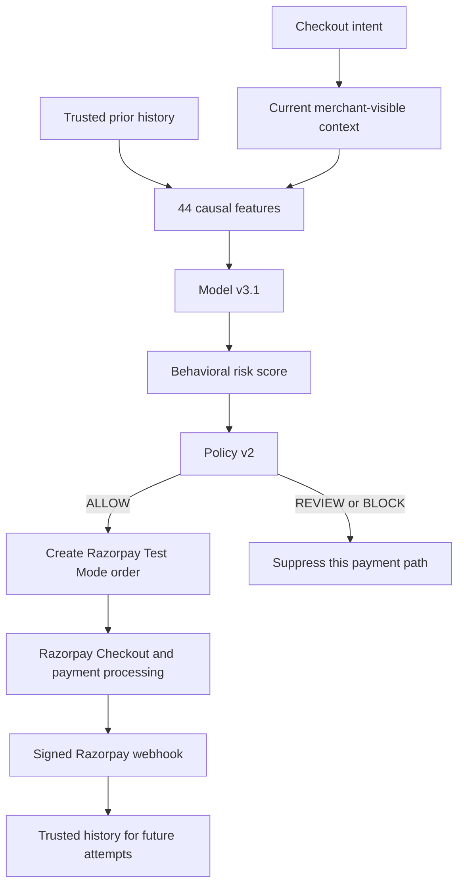

# How Sentinel Works

## The decision path

Model v3.1 estimates behavioral risk. Policy v2 uses that score and supporting
behavioral evidence to choose the action. `ALLOW`, `REVIEW`, and `BLOCK` are
policy actions, not model classes.

## What Sentinel knows at precheck time

Sentinel may use the merchant, amount, device, session, IP reference, optional
customer identifier, timing context, request velocity, and previously trusted
history.

The current card number, current card last4, current card network, and current
payment result do not exist at this point. They cannot influence their own
current precheck. This is the central causal boundary.

## What each action means

| Action | Meaning |
|---|---|
| `ALLOW` | Sentinel permits Razorpay order creation. It does not mean Razorpay or the bank approved payment. |
| `REVIEW` | Sentinel suppresses this attempt because risk is elevated. The prototype has no human review, OTP, or 3DS workflow. |
| `BLOCK` | Sentinel suppresses this attempt because the score and supporting evidence meet the stronger intervention rule. It is not a permanent ban. |

Every later checkout is independently rescored. A sequence can therefore be
non-monotonic, for example `REVIEW → ALLOW → REVIEW → BLOCK → REVIEW`, because
time windows and genuinely available history change.

`REVIEW` and `BLOCK` create no Razorpay order and therefore no payment outcome.
An `ALLOW` attempt may proceed to Razorpay. Only a verified, signed Razorpay
webhook can add its authoritative payment result to future history.

## Browser callback versus webhook

A browser callback helps update the customer interface, but it is not trusted
for behavioral history because browser requests can be manipulated. The server
verifies the Razorpay webhook signature over the raw request body before it
records a payment outcome.

## Replay behavior

Replay Lab controls the synthetic attempts and simulated lifecycle events. It
does not assign the decisions. Each attempt goes through `RiskService`,
`FeatureEngineV3`, Model v3.1, Policy v2, and the same state-transition rules as
a live precheck.

For an allowed replay attempt, the simulator may generate a synthetic outcome.
For `REVIEW` or `BLOCK`, it suppresses that payment lifecycle. A later synthetic
checkout intent can still occur because the intervention applies to one attempt.
