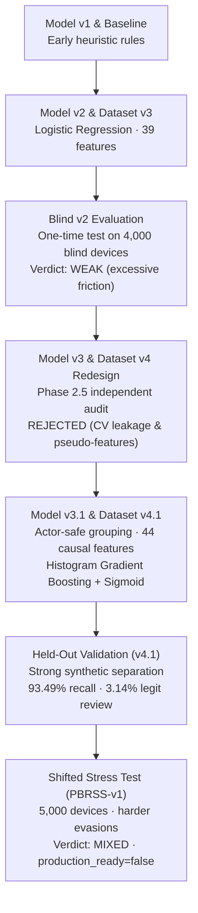

# Technical Evidence & Evaluation Reports

This directory contains the experimental records, candidate benchmarks, failure diagnoses, integration verifications, and stress evaluations for **Card-Testing Sentinel**.

Sentinel is evaluated as an **evaluated prototype**, not a production fraud system (`production_ready=false`). The documentation preserves negative and mixed evaluation results rather than rewriting them away.

---

## 1. Final Evaluation in Plain English

Card-Testing Sentinel performs strongly inside its synthetic development environment: on 3,500 held-out development devices, it detected **93.49%** of card-testing attacks while sending only **3.14%** of legitimate devices to review.

When tested against an unfamiliar, deliberately shifted stress distribution ([PBRSS-v1](phase_3c_pbrss_v1_one_score_evaluation.md)), overall attack intervention remained high (**96.40%** review recall; **92.16%** of attack devices had received REVIEW or BLOCK by attempt 3). However, legitimate customer review friction spiked to **20.72%** (reaching **25.30%** during ordinary checkout), and probability calibration degraded substantially.

Under strict evaluation governance, **no post-stress tuning was performed**. Attack coverage stayed high under distribution shift, but legitimate REVIEW friction and calibration degraded substantially. Therefore the stress result is **`MIXED`** and the system remains **`production_ready=false`**: it demonstrates that behavioral card-testing sequences can be intercepted before Razorpay order creation, but legitimate-user friction remains too high for unassisted production checkout.

---

## 2. Current Active System

| Component | Active Selection | Key Property |
|---|---|---|
| **Development Dataset** | Dataset v4.1 (`development-v4.1`) | 12,000 devices (8,500 train, 3,500 validation); 20 merchants; 6 archetypes |
| **Causal Features** | 44 features (`merchant-visible-causal-3.1`) | Strictly causal; current payment metadata excluded |
| **Active Model** | Model v3.1 (`hist_gb_2`) | Histogram Gradient Boosting; 5-fold actor-safe grouped cross-validation |
| **Calibration** | Sigmoid (Platt scaling) | Preserves exact score ranking; reduces ECE by 73% |
| **Active Policy** | Policy v2 (`validation-selected-v2`) | `REVIEW >= 0.75`; `BLOCK >= 0.90` + 2 evidence signals (`v2_full`) |
| **Gateway Boundary** | Razorpay Standard Checkout (Test Mode) | Order created only for `ALLOW`; `REVIEW`/`BLOCK` suppress order creation |
| **Stress Benchmark** | Shifted Stress Suite (`PBRSS-v1`) | 5,000 devices; 25% synthetic attack prevalence; frozen one-score execution |
| **Final Verdict** | **`MIXED`** | High attack coverage; excessive legitimate review friction |
| **Production Ready** | **`false`** | Evaluated prototype candidate |
| **Automated Tests** | 280 Python passed · 69 Frontend passed | 262 slow tests deselected; release and runtime verifiers passed |
| **HTTP Latency** | **33.83 ms p50** (500 sequential requests) | p95 110.73 ms; p99 183.19 ms; 0 errors on local loopback HTTP |

---

## 3. How the Evaluation Evolved

The project did not arrive at Model v3.1 in a single leap. It progressed through empirical evaluations, discovered critical failures, rejected flawed methodology, and corrected its foundations:

### 1. Historical Model v2 and the Blind v2 Failure
* **The System:** Regularized Logistic Regression trained on 39 features with isotonic calibration and Policy v2.
* **The Test:** A one-time frozen evaluation against 4,000 blind synthetic devices (800 attack, 3,200 legitimate).
* **The Verdict:** **`WEAK`**. While it detected 70.50% of attacks, it imposed unacceptable friction on legitimate shoppers (14.91% review rate; 5.09% hard block rate). It struggled with patient, distributed, and camouflaged testing patterns.
* **Evidence:** [`phase_12_blind_v2_freeze_report.md`](phase_12_blind_v2_freeze_report.md) and [`phase_13_blind_v2_evaluation_report.md`](phase_13_blind_v2_evaluation_report.md).

### 2. The Model v3 / Dataset v4 Redesign and Its Rejection
* **The Attempt:** An initial attempt to improve detection by expanding features and synthetic scenarios.
* **The Discovery:** An independent Phase 2.5 audit uncovered critical methodological problems:
  * *Grouping Leakage:* Cross-validation folds were partitioned on `(customer_id, device_id)` pairs rather than correlated actors; 382 out of 803 multi-device training actors crossed folds.
  * *Ungrounded Pseudo-Features:* Heuristic ratios like `merchant_relative_velocity_zscore` and `merchant_amount_log_ratio` were hardcoded without real merchant baseline context.
  * *Determinism Flaws:* Non-deterministic timestamps compromised byte reproducibility.
* **The Decision:** Model v3 and Dataset v4 were **formally rejected** and quarantined to [`archive/`](../archive/).
* **Evidence:** [`phase_2_5_model_v3_audit.md`](../archive/reports/phase_2_5_model_v3_audit.md).

### 3. Corrected Model v3.1 Methodology
* **The Rebuild:** Built on Dataset v4.1, where related actors were kept together across model-validation splits using `leakage_group_id` (zero CV fold-straddling, zero train/validation overlap).
* **Candidate Selection:** 13 candidate models were trained on 8,500 training devices using 5-fold actor-safe grouped cross-validation. Histogram Gradient Boosting (`hist_gb_2`) won with out-of-fold PR-AUC of **0.9384** and ROC-AUC of **0.9790**, outperforming regularized logistic baselines (~0.8724 PR-AUC).
* **Probability Calibration:** Sigmoid (Platt scaling) was selected because it preserved exact score rankings (zero ranking loss) while reducing Expected Calibration Error from 0.0554 to 0.0147. Isotonic calibration was discarded because it caused a 0.0074 PR-AUC ranking loss.
* **Policy v2 Retention:** Policy v2 (`review >= 0.75`, `block >= 0.90` + 2 evidence signals) was originally selected under Model v2 and retained unchanged after Model v3.1 validation checks showed acceptable operating behavior.
* **Evidence:** [`phase_2_6_model_v3_1_development.md`](phase_2_6_model_v3_1_development.md).

---

## 4. Held-Out Development Validation Result

Before stress testing, Model v3.1 was evaluated on the held-out Dataset v4.1 validation split: **3,500 devices** (630 attack, 2,870 legitimate; 18% attack prevalence).

> **Definition:** `REVIEW+` indicates that a device received either a `REVIEW` or a `BLOCK` decision (the total intervention coverage).

| Metric | Development Gate | Model v3.1 Result | Status |
|---|:---:|---:|:---:|
| **Attack REVIEW+ Recall** | $\ge 70.0\%$ | **93.49%** (589 / 630) | Met stretch ($\ge 80\%$) |
| **Attack BLOCK Recall** | Diagnostic | **67.46%** (425 / 630) | Strong blocking |
| **Legitimate REVIEW+ Friction** | $\le 6.0\%$ | **3.14%** (90 / 2,870) | Met stretch ($\le 4\%$) |
| **Legitimate BLOCK Rate** | $\le 1.0\%$ | **0.14%** (4 / 2,870) | Met stretch ($\le 0.5\%$) |
| **PR-AUC (Device-Weighted)** | $\ge 0.70$ | **0.9169** | Strong precision-recall |
| **ROC-AUC (Device-Weighted)** | $\ge 0.85$ | **0.9693** | High discrimination |
| **Brier Score** | $\le 0.080$ | **0.0410** | Accurate probabilities |
| **Expected Calibration Error (ECE)** | $\le 0.030$ | **0.0214** | Low calibration error |
| **Counterfactual Ordering (CPOA)** | $\ge 90.0\%$ | **100.0%** (20 / 20 pairs) | All 20 declared pairs ordered correctly |

**What this means:** Inside its synthetic development environment, Model v3.1 showed strong separation between card testing and legitimate checkout behavior across the evaluated scenarios. All 20 declared counterfactual pairs were ordered correctly, providing evidence that the model responds to the intended behavioral differences rather than only obvious surface attributes.

---

## 5. Harder Shifted Stress Result (PBRSS-v1)

Once development was complete, the entire runtime stack (Model v3.1, 44 features, Policy v2) was **frozen**. It was then evaluated once against the Post-Blind Remediation Stress Suite v1 ([`PBRSS-v1`](phase_3c_pbrss_v1_one_score_evaluation.md)).

PBRSS-v1 contains **5,000 devices** (1,250 attack, 3,750 legitimate; 25% benchmark attack prevalence) introducing stealth low-amount drip, hybrid credential stuffing, mixed-card probing, micro-donations, and corporate cards.

### Frozen Stress Metrics
| Metric | Development Validation | Frozen PBRSS-v1 Result | Shift Impact |
|---|---:|---:|---|
| **Attack REVIEW+ Recall** | 93.49% | **96.40%** (1,205 / 1,250) | Attack coverage remained high (+2.91 pp) |
| **Attack BLOCK Recall** | 67.46% | **59.12%** (739 / 1,250) | Hard block rate dropped (-8.34 pp) |
| **Legitimate REVIEW+ Friction** | 3.14% | **20.72%** (777 / 3,750) | Severe friction increase (+17.58 pp) |
| **Legitimate BLOCK Rate** | 0.14% | **0.16%** (6 / 3,750) | Hard blocks remained safely bounded |
| **Ordinary Checkout Review Rate** | ~3.0% | **25.30%** (759 / 3,000) | Concentrated in ordinary shopping |
| **PR-AUC (Device-Weighted)** | 0.9169 | **0.646976** | Discrimination degraded under shift |
| **ROC-AUC (Device-Weighted)** | 0.9693 | **0.726189** | Discrimination degraded under shift |
| **Brier Score** | 0.0410 | **0.156037** | Probability accuracy degraded |
| **Expected Calibration Error** | 0.0214 | **0.140679** | Probabilities drifted high |

### Benchmark Policy Precision
* **REVIEW+ Precision:** $\frac{1,205}{1,205 + 777} \approx \mathbf{60.80\%}$
* **BLOCK Precision:** $\frac{739}{739 + 6} \approx \mathbf{99.19\%}$

> **Important:** These precision figures are **device-level, policy-level, and conditional on the synthetic benchmark's 25% attack prevalence**. They are not claims of production precision.

### Detection Timing (When Were Attacks Caught?)
* Detected by attempt 1: **23.20%**
* Detected by attempt 2: **25.20%**
* Detected by attempt 3: **92.16%**
* Detected by attempt 5: **96.40%**
* **Median first detection attempt:** **3**

---

## 6. What the Stress Test Revealed (`MIXED`)

The evaluation verdict is **`MIXED`** because the system succeeded on coverage but degraded on customer friction:

### What Held Up
1. **High Attack Coverage:** 96.40% of card-testing devices were intercepted before checkout completion.
2. **Early Detection:** 92.16% of attack devices had received REVIEW or BLOCK by attempt 3.
3. **Low legitimate hard-block rate:** Legitimate hard blocks remained low (0.16%; 6 out of 3,750 legitimate devices).
4. **BLOCK precision:** BLOCK precision was 99.19% under this synthetic benchmark's 25% attack prevalence (conditional on benchmark prevalence; not a production guarantee).

### What Degraded
1. **Excessive Legitimate Review Friction:** 20.72% legitimate REVIEW+ (and 25.30% in ordinary checkout) represents substantial customer friction and is too high for direct production use without additional handling or step-up mechanisms.
2. **Probability Calibration Degradation:** Probabilities learned on development traffic drifted significantly under distribution shift; ECE rose from 0.0214 to 0.1407.
3. **Distributed Botnet Weakness:** Coordinated botnets spreading single card attempts across distinct devices avoided the multi-failure history needed for hard blocks (0% hard blocks on diffuse botnets).

### Evaluation Discipline: No Post-Stress Tuning
Under strict one-score governance, the PBRSS-v1 evaluation was executed **exactly once**. No model parameters, feature definitions, or policy thresholds were adjusted to "fix" the stress numbers. The prototype is documented with its real failure modes intact.

---

## 7. Merchant False-Positive Economics

High attack detection is not enough if legitimate-customer friction costs more than the fraud losses it prevents.

The project applied the frozen PBRSS-v1 operating rates (96.40% attack review, 59.12% attack block, 20.56% legitimate review-only, 0.16% legitimate block) to three illustrative merchant scenarios ($N = 100,000$ checkout attempts):

| Scenario | Modeled Attack Prevalence | Modeled Economics | Illustrative Result | Viability Assessment |
|---|:---:|---|:---:|---|
| **Quiet Day** | **0.10%** (100 attacks) | Attack cost INR 2,000 · Review cost INR 40 · Block cost INR 500 | **Net: INR −708,698** | **Negative modeled value under these assumptions** (review friction costs exceed prevented fraud) |
| **Active Campaign** | **2.00%** (2,000 attacks) | Attack cost INR 2,000 · Review cost INR 40 · Block cost INR 500 | **Net: INR +2,971,648** | **Positive modeled value under these assumptions** (fraud savings absorb review friction) |
| **Higher-Loss Merchant** | **0.50%** (500 attacks) | Attack cost INR 10,000 · Review cost INR 100 · Block cost INR 1,500 | **Net: INR +2,535,480** | **Positive modeled value under these assumptions** (higher fraud cost lowers break-even prevalence to 0.24%) |

> **Disclaimer:** All financial figures are hypothetical merchant scenario parameters designed to evaluate trade-offs. They are **not** Razorpay financial data, empirical merchant savings, or guarantees.

Full formulas, break-even derivations, and scenario code: [`phase_4d_economic_scenario_analysis.md`](phase_4d_economic_scenario_analysis.md).

---

## 8. Real Gateway Integration & Runtime Evidence

Card-Testing Sentinel is an integrated web application, not an offline machine learning notebook:

* **Real Order Gating:** In Razorpay Test Mode, an `ALLOW` decision creates an order via the Razorpay API; `REVIEW` and `BLOCK` decisions reject order creation with HTTP 409 (`payment_order_not_allowed`).
* **Cryptographic Webhook Boundary:** Browser callbacks are treated as non-authoritative. Live payment history updates only after an authoritative, HMAC-SHA256-signed Razorpay webhook (`payment.failed`, `order.paid`) is verified with constant-time comparison.
* **Idempotency & Lifecycle Monotonicity:** Replays of identical precheck payloads return cached decisions (`idempotent_replay: true`). Changed payloads on duplicate IDs are rejected (HTTP 409). Stale webhook events cannot regress terminal payment status.
* **State Persistence Across Restarts:** The service uses SQLite WAL mode. Server stop-and-restart tests verify that persisted counters and state versions are reconstructed correctly from disk.
* **Local HTTP Latency:** Sequential benchmarking across 500 local loopback `/api/precheck` HTTP requests (FastAPI + Pydantic + FeatureEngineV3 + Model v3.1 + SQLite WAL) measured:
  * **p50 (Median): 33.83 ms**
  * **p95: 110.73 ms**
  * **p99: 183.19 ms**
  * **Failures: 0 / 500**

Full integration evidence: [`phase_4c_razorpay_e2e_latency.md`](phase_4c_razorpay_e2e_latency.md) and [`phase_5b_1_real_razorpay_failure_lifecycle.md`](phase_5b_1_real_razorpay_failure_lifecycle.md).

---

## 9. Technical Evidence Index

The technical reports are organized below according to their role in the evaluation:

### Category A: Current Canonical Evidence (Read These First)
The definitive technical evidence describing the active system:

1. [`phase_2_6_dataset_v4_1_audit.md`](phase_2_6_dataset_v4_1_audit.md) — Complete audit of Dataset v4.1: volume quotas, leak-free partition verification, and counterfactual pair construction.
2. [`phase_2_6_model_v3_1_development.md`](phase_2_6_model_v3_1_development.md) — 13-candidate benchmark on TRAIN, Sigmoid vs. Isotonic calibration, and held-out validation results.
3. [`phase_3c_pbrss_v1_one_score_evaluation.md`](phase_3c_pbrss_v1_one_score_evaluation.md) — **FROZEN / HASH-BOUND.** The canonical one-time distribution-shift stress evaluation and `MIXED` verdict.
4. [`phase_4c_razorpay_e2e_latency.md`](phase_4c_razorpay_e2e_latency.md) — Razorpay order gating, idempotency, lifecycle checks, and the 500-request local HTTP latency benchmark.
5. [`phase_4d_economic_scenario_analysis.md`](phase_4d_economic_scenario_analysis.md) — Three-scenario false-positive merchant economics, break-even analysis, and quiet-day negative utility.
6. [`phase_5b_1_real_razorpay_failure_lifecycle.md`](phase_5b_1_real_razorpay_failure_lifecycle.md) — End-to-end Razorpay Test Mode failure webhook correlation and trusted history progression.

### Category B: Supporting Current Evidence
Detailed analyses supporting the active Model v3.1 / Policy v2 runtime:

7. [`phase_2_6_model_v3_1_ablations.md`](phase_2_6_model_v3_1_ablations.md) — 10 targeted feature ablations measuring the contribution of feature families.
8. [`phase_4a_post_pbrss_diagnosis.md`](phase_4a_post_pbrss_diagnosis.md) — Diagnostic analysis examining why ordinary checkout suffered elevated review friction.
9. [`phase_4b_v3_1_runtime_integration.md`](phase_4b_v3_1_runtime_integration.md) — Runtime binding of FeatureEngineV3, Model v3.1, and isolated SQLite database.
10. [`phase_11_policy_v2_report.md`](phase_11_policy_v2_report.md) — Provenance of Policy v2 selection under Dataset v3 validation (retained unchanged for Model v3.1).
11. [`phase_5a_final_figures.md`](phase_5a_final_figures.md) — Generation provenance for evaluator-facing charts and diagrams from committed artifacts.

### Category C: Historical Frozen Evaluations
Preserved negative results from earlier iterations; never modified or overwritten:

12. [`phase_12_blind_v2_freeze_report.md`](phase_12_blind_v2_freeze_report.md) — Pre-evaluation freeze snapshot of Model v2 and the Blind v2 dataset.
13. [`phase_13_blind_v2_evaluation_report.md`](phase_13_blind_v2_evaluation_report.md) — **FROZEN / HASH-BOUND.** The one-time Blind v2 evaluation of Model v2 (`WEAK` verdict).
14. [`post_blind_stress_v1_evaluation_report.md`](post_blind_stress_v1_evaluation_report.md) — **FROZEN / HASH-BOUND.** Generated pointer file produced by the PBRSS one-score evaluator.

### Category D: Rejected & Archived Experiment Evidence
Flawed experiments rejected by internal methodology audits and moved to [`archive/reports/`](../archive/reports/):

15. [`phase_2_5_model_v3_audit.md`](../archive/reports/phase_2_5_model_v3_audit.md) — The independent audit that **rejected Model v3 and Dataset v4** due to CV fold leakage and pseudo-features.
16. [`phase_2_dataset_v4_audit.md`](../archive/reports/phase_2_dataset_v4_audit.md) — Initial Dataset v4 audit (pre-rejection).
17. [`phase_2_model_v3_development.md`](../archive/reports/phase_2_model_v3_development.md) — Initial Model v3 candidate benchmarks (pre-rejection).
18. [`phase_2_model_v3_ablations.md`](../archive/reports/phase_2_model_v3_ablations.md) — Initial Model v3 feature ablations (pre-rejection).
19. [`phase_3a_pbrss_v1_pre_generation_audit.md`](../archive/reports/phase_3a_pbrss_v1_pre_generation_audit.md), [`phase_3a1_...`](../archive/reports/phase_3a1_pbrss_v1_pre_generation_correction.md), [`phase_3b_...`](../archive/reports/phase_3b_pbrss_v1_dataset_freeze.md) — Intermediate PBRSS-v1 generation audits and freeze records.

### Category E: Engineering, Process & Security Evidence
Dated checkpoints documenting software engineering quality and environment validation:

20. [`browser_verification.md`](browser_verification.md) — Manual browser verification checklist across scenarios.
21. [`clean_install_verification.md`](clean_install_verification.md) — Clean virtualenv installation and dependency resolution verification.
22. [`dependency_security_audit.md`](dependency_security_audit.md) — Automated pip-audit vulnerability scan of pinned dependencies.
23. [`final_hardening_baseline.md`](final_hardening_baseline.md) & [`final_hardening_inventory.md`](final_hardening_inventory.md) — Process baseline tracking during system hardening.
24. [`repository_hygiene_report.md`](repository_hygiene_report.md) — Code formatting, linting, and structural cleanliness audit.
25. [`submission_cleanup_inventory.md`](submission_cleanup_inventory.md) — Artifact cleanup checklist.

### Category F: Superseded Reports (Context & Successor Map)
Historical reports that contain outdated test counts or superseded benchmarks, preserved strictly for development provenance:

* [`decision_path_benchmark.md`](decision_path_benchmark.md) — Early 2026-08-26 micro-benchmark (`~2–5 ms`); **superseded** for headline latency by [`phase_4c_razorpay_e2e_latency.md`](phase_4c_razorpay_e2e_latency.md) (`33.83 ms p50` loopback HTTP).
* [`final_hardening_report.md`](final_hardening_report.md) — Pre-PBRSS hardening checkpoint; **superseded** by the active runtime and verification suite.
* [`submission_cleanup_report.md`](submission_cleanup_report.md) — Documents Model v2 cleanup state; **superseded** by Model v3.1.

---

## 10. Frozen and Hash-Bound Files Warning

> **CRITICAL:** Do not modify the following Markdown reports under any circumstances. Their exact SHA-256 byte hashes are cryptographically verified by committed result manifests:
>
> 1. `reports/phase_13_blind_v2_evaluation_report.md`
>    * Bound in [`artifacts/evaluation/blind_v2_result_hashes.json`](../artifacts/evaluation/blind_v2_result_hashes.json)
>    * Checked by: `python scripts/verify_release.py`
> 2. `reports/phase_3c_pbrss_v1_one_score_evaluation.md`
>    * Bound in [`artifacts/evaluation/pbrss_v1_result_manifest.json`](../artifacts/evaluation/pbrss_v1_result_manifest.json)
>    * Checked by: `python scripts/verify_runtime_v3_1.py`
> 3. `reports/post_blind_stress_v1_evaluation_report.md`
>    * Bound in [`artifacts/evaluation/pbrss_v1_result_manifest.json`](../artifacts/evaluation/pbrss_v1_result_manifest.json)
>    * Checked by: `python scripts/verify_runtime_v3_1.py`
>
> Editing even a single character in these files will cause automated CI and release verifiers to fail immediately.
