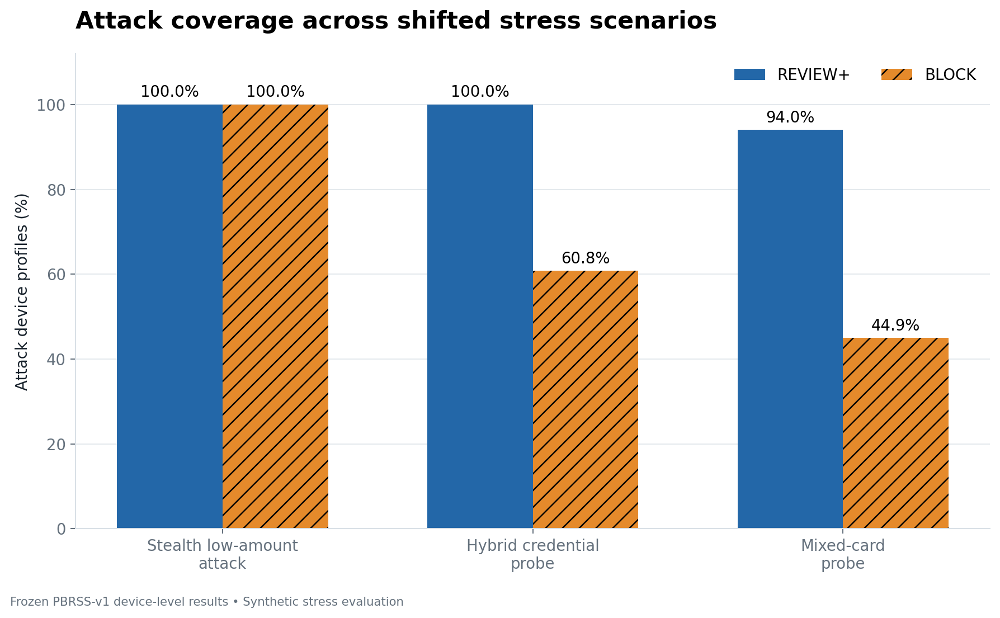
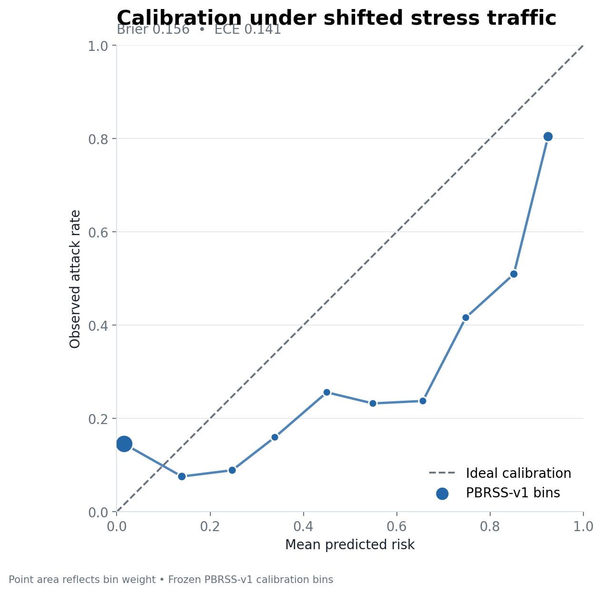
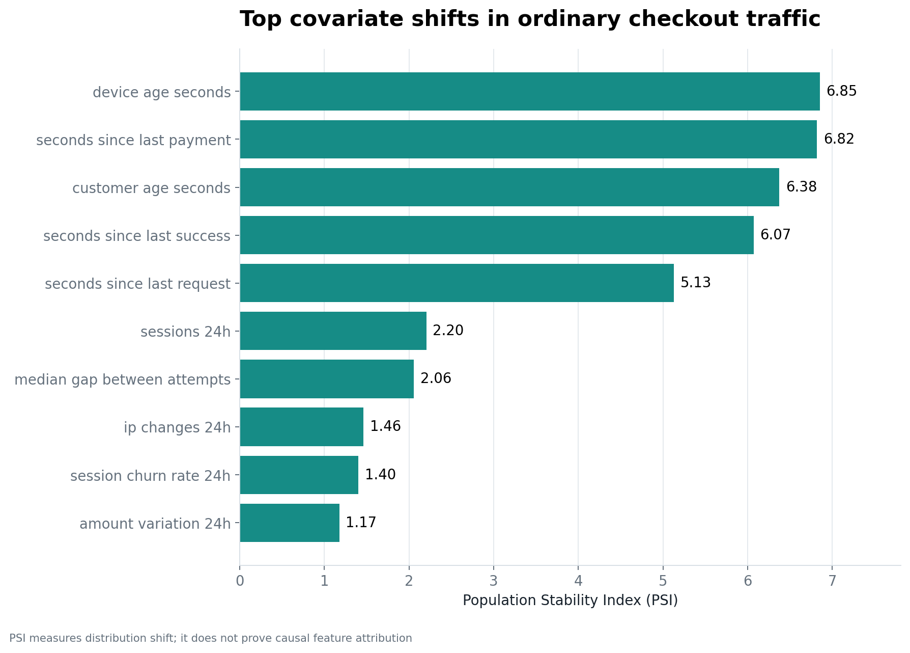
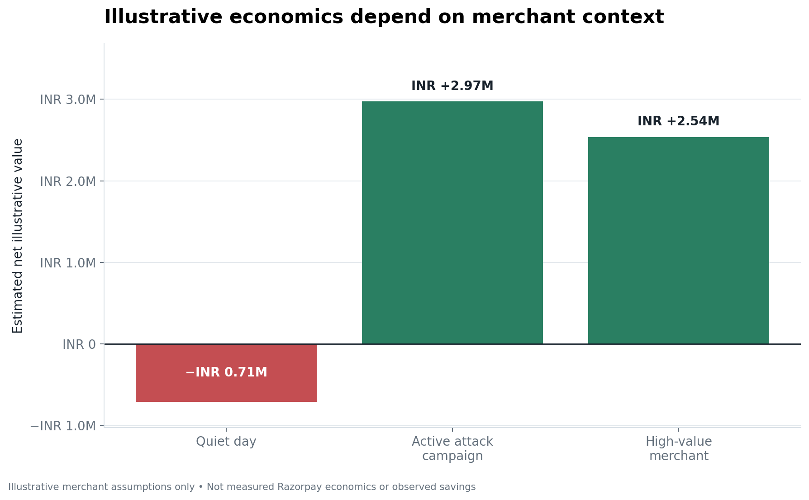

# Phase 5A — Final Evaluation, Runtime, and Economic Figures

**VISUALIZATION ONLY**

**NO MODEL RESCORING · PBRSS NOT RESCORED · MODEL v3.1 UNCHANGED · POLICY v2 UNCHANGED**

**FIGURES ARE DERIVED FROM ALREADY-COMMITTED FROZEN EVIDENCE**

## 1. Starting point

- Starting commit: `85e5a51dd7bcfabfc1642c27d544366ac44f4e23`
- Starting working tree: clean
- Purpose: presentation-ready visualization of frozen evaluation, diagnostic, runtime, and illustrative economic evidence

No model artifact, FeatureEngine, RiskService, hidden prediction, threshold, or evaluation pipeline was loaded or invoked.

## 2. Figures created

Seven PNG figures and one provenance manifest were generated in `artifacts/figures/`. No figure was skipped because every requested chart had a committed structured source.

### Attack scenario performance



- Source: `artifacts/evaluation/pbrss_v1_family_metrics.csv`
- Stealth low-amount attack: REVIEW+ 100.0%, BLOCK 100.0%
- Hybrid credential probe: REVIEW+ 100.0%, BLOCK 60.8%
- Mixed-card probe: REVIEW+ 94.0%, BLOCK 44.9333%
- Unit: frozen PBRSS-v1 device-level attack profiles

### Detection delay


- Source: `artifacts/evaluation/pbrss_v1_detection_delay.json`
- Cumulative attack REVIEW+: attempt 1 23.2%, attempt 2 25.2%, attempt 3 92.16%, attempt 5 96.4%
- Interpretation: early attempts contain limited behavioral history; surfacing rises sharply by attempt 3
- No attempt-4 value was interpolated or invented

### Legitimate-user friction


- Source: `artifacts/evaluation/pbrss_v1_family_metrics.csv`
- Charity spike: REVIEW+ 0.0%, BLOCK 0.0%
- B2B corporate-card traffic: REVIEW+ 7.2%, BLOCK 0.8%
- Ordinary checkout: REVIEW+ 25.3%, BLOCK 0.1333%
- Main limitation: legitimate REVIEW+ friction concentrates in the ordinary-checkout profile

### Calibration



- Sources: `artifacts/evaluation/pbrss_v1_calibration.csv` and `artifacts/evaluation/pbrss_v1_metrics.json`
- Brier score: 0.15603701503584233
- ECE: 0.14067900697104643
- Ten committed bins provide mean predicted risk, observed attack rate, and bin weight
- Interpretation: calibration transferred poorly under shifted synthetic stress traffic

### Phase 4A feature shift



- Source: `artifacts/analysis/phase_4a_ordinary_checkout_feature_shift.csv`
- Plotted directly from the ten highest PSI rows in the committed CSV
- Highest PSI values: `device_age_seconds` 6.8536, `seconds_since_last_payment` 6.8200, `customer_age_seconds` 6.3754, `seconds_since_last_success` 6.0734, and `seconds_since_last_request` 5.1314
- PSI measures distribution shift. It does **not** prove individual causal feature attribution or feature importance.

### Runtime latency


- Source: `artifacts/runtime/phase_4c_precheck_latency.json`
- p50 33.830896 ms; p90 87.779987 ms; p95 110.732069 ms; p99 183.188133 ms
- Evidence basis: 500 sequential local requests, zero errors
- This is a local non-production benchmark, not production latency

### Illustrative economic scenarios



- Source: `artifacts/economics/phase_4d_economic_scenarios.json`
- Quiet day: estimated net illustrative value INR −708,697.60
- Active attack campaign: estimated net illustrative value INR 2,971,648.00
- High-value merchant: estimated net illustrative value INR 2,535,480.00
- Illustrative merchant assumptions only—not measured Razorpay economics, observed losses, or observed savings

## 3. Figure provenance

`artifacts/figures/figure_manifest.json` records, for every figure:

- filename and title
- source artifact path and SHA-256
- exact metrics passed to the visualization
- generation script
- `generated_from_frozen_evidence: true`
- `model_rescored: false`
- `pbrss_rescored: false`

The manifest contains no timestamp or random identifier.

## 4. Skipped charts

None. Committed PBRSS-v1 calibration bins contain the required mean-predicted-risk and observed-rate columns, so the calibration figure was created without rescoring. If those bins are missing or incomplete, the generator safely records a skip reason and does not attempt reconstruction.

## 5. Visualization limitations

- PBRSS-v1 results are synthetic, device-level shifted-stress evidence, not production transaction metrics.
- REVIEW+ includes BLOCK and should not be interpreted as hard blocks alone.
- Connecting observed detection-delay points does not create an attempt-4 observation.
- The calibration chart describes performance on the shifted suite and does not establish production calibration.
- PSI is distribution-shift evidence, not causal attribution or feature importance.
- Latency is from one sequential local benchmark and is not a production SLO.
- Economic values depend entirely on illustrative merchant-side inputs and are not claims of savings.
- Charts intentionally omit production-readiness claims; `production_ready` remains false.

## 6. Determinism and reproducibility

Run:

```bash
.venv/bin/python scripts/generate_final_figures.py
```

The script uses a headless Matplotlib backend, fixed styling, source-defined ordering or explicit narrative label ordering, no randomness, and no timestamps. The JSON manifest is emitted with stable sorted keys. PNG rendering uses fixed dimensions, DPI, fonts, and metadata; tests validate the underlying data and specification rather than relying on platform-specific image bytes.

## 7. Test and verifier evidence

- Targeted Phase 5A tests: 8 passed
- Figure-generator lint: passed
- Visual inspection: all seven PNGs checked for clipping, label collision, hierarchy, axis integrity, and disclaimer visibility
- Historical frozen-release verifier: passed (`frozen-v2-runtime`, Model v2,
  39 features, blind-v2 verdict `WEAK`, `post_blind_tuning: false`)
- Model v3.1 runtime verifier: passed
  (`postblind-v3.1-prototype-runtime`, 44 features, PBRSS-v1 conclusion
  `MIXED`, `pbrss_rescored: false`, `production_ready: false`)
- Full repository suite: 275 passed, 262 deselected, one non-blocking joblib
  physical-core discovery warning, 89% coverage
- Protected runtime, evidence, README, and frontend paths: unchanged
- `git diff --check`: passed
